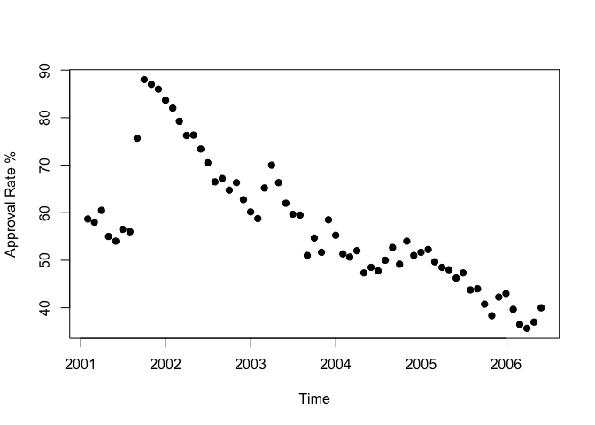
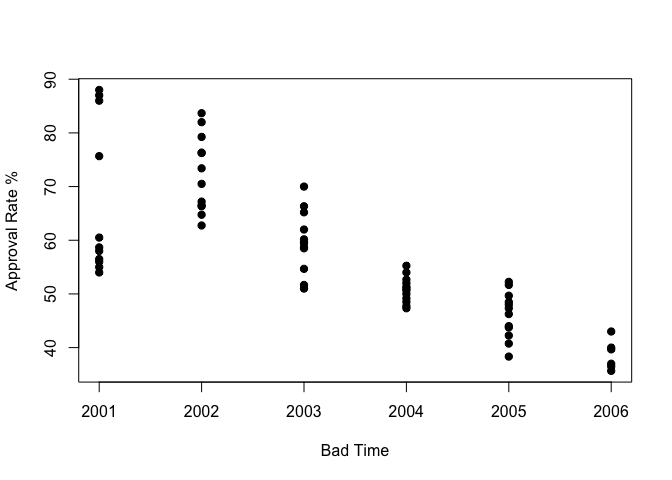
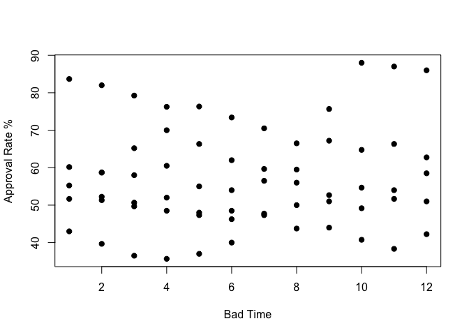
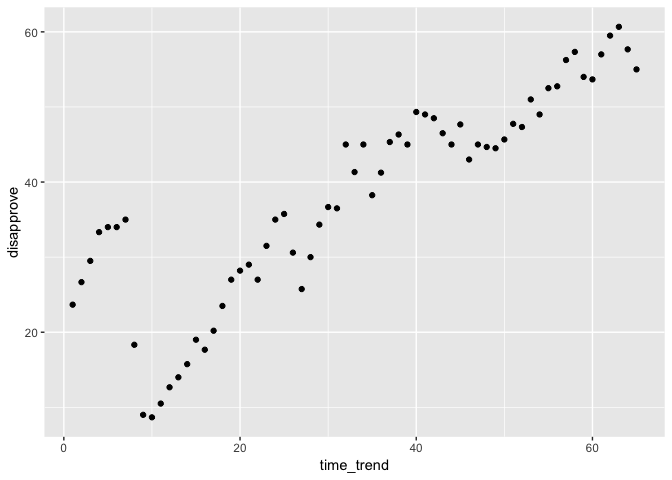
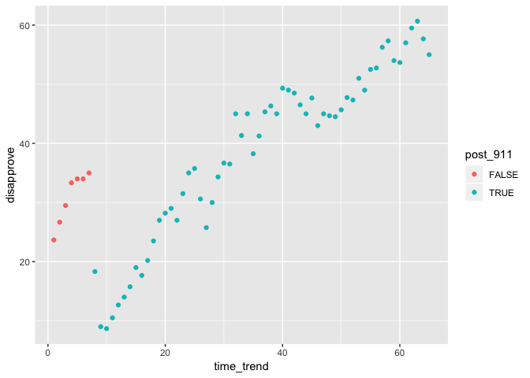

## Week 2: Introduction to R part 2: Enter the Tidyverse (I'm so so sorry)

*Note: to keep up with this set of lab notes, you'll need to download the 'approval' dataset. The location of this CSV is: https://vincentarelbundock.github.io/Rdatasets/csv/Zelig/approval.csv*

Hello everybody! Welcome to week 2!
  
## Lesson 0: Quick review from last time
  
We learned last time about:

 - Objects in R
 
 - Functions in R
 
 - Math operators in R
 
 - Object types in R
 
 - How to load packages
 
 - Dataframes
 
 - Basic Plots
 
 - Regression Models
 
This time, we will introduce the tidyverse, and show you how to load your own data into the R workspace.

## Lesson 1

Before we learn to read data into R, it would be helpful to know how to tell R
where it is. This is important because later in the class we need to load files from our local machine. Eventually, we want to start using our own data instead of data contained in a package. 
 
 - Note: Windows and R can both use directory separator `/`. Windows can also use `\\` (must be double).
 - Find your current directory: `getwd()`. "wd" stands for working directory.

```r
getwd()
```

```
## [1] "/Users/connor/Dropbox/EC421_Lab/Week2/R-markdown"
```
 
 - Change directories: `setwd()`
 

```r
setwd("/Users/connor/Dropbox/EC421_Lab/Week2/data")
```
 
 - Show files in the current directory: `dir()`
 

```r
dir()
```

```
##  [1] "Ed_version.html" "Ed_version.Rmd"  "GE_version.html"
##  [4] "GE_version.Rmd"  "Lab 2.Rmd"       "Lab_2_files"    
##  [7] "Lab_2.html"      "Lab_2.md"        "Lab_2.pdf"      
## [10] "Lab_2.Rmd"
```
 
 - Notice that directories are characters (surrounded by `""`).
 - RStudio will help you complete file paths when you hit tab while typing in the console.
 - You can save an object with the directory location and then return to that directory using `setwd()`. Example:
 

```r
my_dir <- "/Users/connor/Dropbox/EC421_Lab/Week2/data"
setwd(my_dir)
```
 
 - Another example:
 - `my_dir <- "Home/Folder1/Folder2"`
 - `setwd(my_dir)`
 - Move up a level in the directory: `setwd("..")`
 

```r
setwd("..")
getwd()
```

```
## [1] "/Users/connor/Dropbox/EC421_Lab/Week2"
```
 


## Lesson 2: Loading data

R can read in data from just about any source/format. Today we're going to cover reading data saved in CSVs (comma-separated variables).

First, we'll load the `tidyverse` package, which will actually load several packages (we want `readr`). The `base` (basic) installation of R already has a function for reading CSVs, but the function in `tidyverse` (`readr`) is a bit nicer. 

Recall our workflow from last time:
 - Load the 'pacman' package:

```r
#You may need to run install.packages('pacman') on your machine first
library(pacman)
```

- Use pacman's `p_load` to load the tidyverse


```r
#You may need to run install.packages('tidyverse') on your machine first
p_load(tidyverse)
```

You could also use `library(tidyverse)`

Great. Now we have access to the `read_csv()` function which lets us read csvs directly into a data frame. Let's learn a bit about that function. Recall, we can learn about a function through the `?` command.


```r
?read_csv
```

Now we need to work to find a CSV! Today, we'll be working with the `approval` dataset. Let's go find that dataset.
 - Step 1:Download the csv. Where to find it? Well we have options:
 - Search U.S. Presidential Approval Data Vincentarelbundock on Google
 - DL from https://vincentarelbundock.github.io/Rdatasets/csv/Zelig/approval.csv
 - or search for "U.S. Presidential Approval Data" at https://vincentarelbundock.github.io/Rdatasets/datasets.html
 - Step 2: Make sure your downloaded file is in a reasonable directory.
 - You can find the file's filepath by either (windows) right clicking on the file and looking in **properties**, under location
 - Or, (Mac) right click on the file, hold down alt and select the **copy as filepath** option
 - Navigate R to the folder loacation, using the `setwd(my_dir)` command, setting my_dir to the filepath
 - Read the data into R, using `read_csv("../approval.csv")`
 
*Note: R uses the \\ character as an escape character. That means that in order to write to a directory in windows, you may need to double your directory dividers by typing \\\\ in place of \\*
 

 

```r
#I'm putting 'head' here so as not to blow up the notes document with the full dataset
setwd(my_dir)
#put in your own directory path, and your own filepath
head(read_csv(my_path))
```

```
## Warning: Missing column names filled in: 'X1' [1]
```

```
## Parsed with column specification:
## cols(
##   X1 = col_double(),
##   month = col_double(),
##   year = col_double(),
##   approve = col_double(),
##   disapprove = col_double(),
##   unsure = col_double(),
##   sept.oct.2001 = col_double(),
##   iraq.war = col_double(),
##   avg.price = col_double()
## )
```

```
## # A tibble: 6 x 9
##      X1 month  year approve disapprove unsure sept.oct.2001 iraq.war
##   <dbl> <dbl> <dbl>   <dbl>      <dbl>  <dbl>         <dbl>    <dbl>
## 1     1     2  2001    58.7       23.7   17.7             0        0
## 2     2     3  2001    58         26.7   15.3             0        0
## 3     3     4  2001    60.5       29.5   10               0        0
## 4     4     5  2001    55         33.3   11.7             0        0
## 5     5     6  2001    54         34     12               0        0
## 6     6     7  2001    56.5       34      9.5             0        0
## # … with 1 more variable: avg.price <dbl>
```

Notice that we read the data, but it just printed to screen. We want to assign the data to an object (give it a name). 


```r
#let's call our dataset pres_df. In practice, names can be anything you want.
pres_df <- read_csv(my_path)
```

```
## Warning: Missing column names filled in: 'X1' [1]
```

```
## Parsed with column specification:
## cols(
##   X1 = col_double(),
##   month = col_double(),
##   year = col_double(),
##   approve = col_double(),
##   disapprove = col_double(),
##   unsure = col_double(),
##   sept.oct.2001 = col_double(),
##   iraq.war = col_double(),
##   avg.price = col_double()
## )
```
Let's explore this dataset a little bit. Remember how to do that?

Here are a few commands for getting a snapshot of a dataset: `head`, `tail`, `summary`, `table`, `plot`. See the last lab if you forgot what these do

You can perform the following to check out the data

 - `head(pres_df)`
 - `tail(pres_df)`
 - `summary(pres_df)`

What does this do? Try to figure it out.

 - `head(table(pres_df$year > 2003, pres_df$approve > 50))`

Let's make our time variables something we can use more flexibly. We'll do this with the lubridate package. This is included in the tidyverse.


```r
library(lubridate)
```

```
## 
## Attaching package: 'lubridate'
```

```
## The following object is masked from 'package:base':
## 
##     date
```

```r
#Don't worry that we haven't covered mutate yet: we'll get to that command further on in the lecture
pres_df <- mutate(pres_df, year_month = make_datetime(pres_df$year, pres_df$month))
pres_df
```

```
## # A tibble: 65 x 10
##       X1 month  year approve disapprove unsure sept.oct.2001 iraq.war
##    <dbl> <dbl> <dbl>   <dbl>      <dbl>  <dbl>         <dbl>    <dbl>
##  1     1     2  2001    58.7      23.7   17.7              0        0
##  2     2     3  2001    58        26.7   15.3              0        0
##  3     3     4  2001    60.5      29.5   10                0        0
##  4     4     5  2001    55        33.3   11.7              0        0
##  5     5     6  2001    54        34     12                0        0
##  6     6     7  2001    56.5      34      9.5              0        0
##  7     7     8  2001    56        35      9                0        0
##  8     8     9  2001    75.7      18.3    6                1        0
##  9     9    10  2001    88         9      3                1        0
## 10    10    11  2001    87         8.67   4.33             0        0
## # … with 55 more rows, and 2 more variables: avg.price <dbl>,
## #   year_month <dttm>
```

```r
plot(pres_df$year_month, pres_df$approve, pch = 19, xlab = "Time", ylab = "Approval Rate %")
```

<!-- -->

As you can see, lubridate has made our `Time` axis much better than it would be otherwise. Just to show you, trying to set time to the `year` variable:


```r
plot(pres_df$year, pres_df$approve, pch = 19, xlab = "Bad Time", ylab = "Approval Rate %")
```

<!-- -->

And month...


```r
plot(pres_df$month, pres_df$approve, pch = 19, xlab = "Bad Time", ylab = "Approval Rate %")
```

<!-- -->
We could also create a time trend, but that will require the use of the mutate command. Let's look at how the tidyverse helps us manipulate data.

## Lesson 3: Data manipulation

You will often need to do some data work before you're ready to actually implement econometric/statistical modeling. This data work generally includes adding new variables, dropping unwanted observations, and merging datasets.

In R, there are many ways to do the same task. For the most part, we're going to try to stick to the functions contained in the `tidyverse`.


### Selecting columns
Last time, we covered two different methods of selecting a dataframe's columns. The first was by column name

```r
head(pres_df$year)
```

```
## [1] 2001 2001 2001 2001 2001 2001
```

The second was by index number


```r
#Year is the third column in our pres_df dataframe
head(pres_df[,3])
```

```
## # A tibble: 6 x 1
##    year
##   <dbl>
## 1  2001
## 2  2001
## 3  2001
## 4  2001
## 5  2001
## 6  2001
```


The `dplyr` package however (part of the `tidyverse`) offers a nice alternative (plus a lot more functionality).

Let's start with the `select` function. We can grab a column with its name using select


```r
#Select(dataframe_name, column_name)
head(select(pres_df, year))
```

```
## # A tibble: 6 x 1
##    year
##   <dbl>
## 1  2001
## 2  2001
## 3  2001
## 4  2001
## 5  2001
## 6  2001
```

 Alternatively, we can use the pipe operator `%>%`. This takes the dataframe on the left side and passes it to the right. This lets us pass one command to another.
 
 Let's filter our dataframe down to only the `year` and `month` variables, and then pass that dataframe to another filter command that will select only the `month` variable.
 
```r
#first, select month and year, then, select month
head(pres_df %>%
  select(c(year,month)) %>%
  select(month))
```

```
## # A tibble: 6 x 1
##   month
##   <dbl>
## 1     2
## 2     3
## 3     4
## 4     5
## 5     6
## 6     7
```
This is more useful in conjunction with other commands, but this illustrates how the pipe operator works.

### Filtering observations

We already know of some ways to do this, either by mentioning the name of a variable, or by calling a row/column by index.

Grab some of the observations from a data frame:
 - Grab the first 4 rows: `pres_df[1:4,]`
 - 6th, 8th, 12th, 13rd rows: `pres_df[c(6, 8, 12, 13),]`
 

```r
head(pres_df[1:4,])
```

```
## # A tibble: 4 x 10
##      X1 month  year approve disapprove unsure sept.oct.2001 iraq.war
##   <dbl> <dbl> <dbl>   <dbl>      <dbl>  <dbl>         <dbl>    <dbl>
## 1     1     2  2001    58.7       23.7   17.7             0        0
## 2     2     3  2001    58         26.7   15.3             0        0
## 3     3     4  2001    60.5       29.5   10               0        0
## 4     4     5  2001    55         33.3   11.7             0        0
## # … with 2 more variables: avg.price <dbl>, year_month <dttm>
```

```r
head(pres_df[c(6, 8, 12, 13),])
```

```
## # A tibble: 4 x 10
##      X1 month  year approve disapprove unsure sept.oct.2001 iraq.war
##   <dbl> <dbl> <dbl>   <dbl>      <dbl>  <dbl>         <dbl>    <dbl>
## 1     6     7  2001    56.5       34     9.5              0        0
## 2     8     9  2001    75.7       18.3   6                1        0
## 3    12     1  2002    83.7       12.7   3.67             0        0
## 4    13     2  2002    82         14     4                0        0
## # … with 2 more variables: avg.price <dbl>, year_month <dttm>
```
 
 `dplyr` allows us to get a bit more sophisticated:
We can now filter data using a single variable, using the `filter()` command

Only observations in 2001:

```r
filter(pres_df, year == 2001)
```

```
## # A tibble: 11 x 10
##       X1 month  year approve disapprove unsure sept.oct.2001 iraq.war
##    <dbl> <dbl> <dbl>   <dbl>      <dbl>  <dbl>         <dbl>    <dbl>
##  1     1     2  2001    58.7      23.7   17.7              0        0
##  2     2     3  2001    58        26.7   15.3              0        0
##  3     3     4  2001    60.5      29.5   10                0        0
##  4     4     5  2001    55        33.3   11.7              0        0
##  5     5     6  2001    54        34     12                0        0
##  6     6     7  2001    56.5      34      9.5              0        0
##  7     7     8  2001    56        35      9                0        0
##  8     8     9  2001    75.7      18.3    6                1        0
##  9     9    10  2001    88         9      3                1        0
## 10    10    11  2001    87         8.67   4.33             0        0
## 11    11    12  2001    86        10.5    3.5              0        0
## # … with 2 more variables: avg.price <dbl>, year_month <dttm>
```

Only observations in 2001 OR 2002:

```r
tail(filter(pres_df, year %in% c(2001, 2002)))
```

```
## # A tibble: 6 x 10
##      X1 month  year approve disapprove unsure sept.oct.2001 iraq.war
##   <dbl> <dbl> <dbl>   <dbl>      <dbl>  <dbl>         <dbl>    <dbl>
## 1    18     7  2002    70.5       23.5   6                0        0
## 2    19     8  2002    66.5       27     6.5              0        0
## 3    20     9  2002    67.2       28.2   4.6              0        0
## 4    21    10  2002    64.8       29     6.25             0        0
## 5    22    11  2002    66.3       27     6.67             0        0
## 6    23    12  2002    62.8       31.5   5.75             0        0
## # … with 2 more variables: avg.price <dbl>, year_month <dttm>
```

Only observations between 2001 and 2003: 

```r
head(filter(pres_df, between(year, 2001, 2003)))
```

```
## # A tibble: 6 x 10
##      X1 month  year approve disapprove unsure sept.oct.2001 iraq.war
##   <dbl> <dbl> <dbl>   <dbl>      <dbl>  <dbl>         <dbl>    <dbl>
## 1     1     2  2001    58.7       23.7   17.7             0        0
## 2     2     3  2001    58         26.7   15.3             0        0
## 3     3     4  2001    60.5       29.5   10               0        0
## 4     4     5  2001    55         33.3   11.7             0        0
## 5     5     6  2001    54         34     12               0        0
## 6     6     7  2001    56.5       34      9.5             0        0
## # … with 2 more variables: avg.price <dbl>, year_month <dttm>
```

Only observations in 2001 to 2003 using the pipe operator, `%>%`:


```r
head(pres_df %>% filter(between(year, 2001, 2003)))
```

```
## # A tibble: 6 x 10
##      X1 month  year approve disapprove unsure sept.oct.2001 iraq.war
##   <dbl> <dbl> <dbl>   <dbl>      <dbl>  <dbl>         <dbl>    <dbl>
## 1     1     2  2001    58.7       23.7   17.7             0        0
## 2     2     3  2001    58         26.7   15.3             0        0
## 3     3     4  2001    60.5       29.5   10               0        0
## 4     4     5  2001    55         33.3   11.7             0        0
## 5     5     6  2001    54         34     12               0        0
## 6     6     7  2001    56.5       34      9.5             0        0
## # … with 2 more variables: avg.price <dbl>, year_month <dttm>
```

Filter observations using multiple variables
`sept.oct.2001` is `1` OR `iraq.war` is `1`. Recall our 'or' symbol, |

```r
filter(pres_df, sept.oct.2001 == 1 | iraq.war == 1)
```

```
## # A tibble: 5 x 10
##      X1 month  year approve disapprove unsure sept.oct.2001 iraq.war
##   <dbl> <dbl> <dbl>   <dbl>      <dbl>  <dbl>         <dbl>    <dbl>
## 1     8     9  2001    75.7       18.3   6                1        0
## 2     9    10  2001    88          9     3                1        0
## 3    26     3  2003    65.2       30.6   4.2              0        1
## 4    27     4  2003    70         25.8   4.25             0        1
## 5    28     5  2003    66.3       30     3.67             0        1
## # … with 2 more variables: avg.price <dbl>, year_month <dttm>
```

### Creating (mutating) new variables

`dplyr` also makes it easy to create add new variables using `mutate`. Mutate takes as arguments a dataframe and then some function to use to create a new column. Mutate will then output an **entirely new dataframe** with your new column added on.

Let's work through a few examples:

A column of ones: 

```r
#Let's look just at the column we created, by using the $ operator. Because mutate passes an entire dataframe, we can call columns from the mutate() function just as we would an ordinary dataframe.
head(mutate(pres_df, ones = 1)$ones)
```

```
## [1] 1 1 1 1 1 1
```

If we wanted to keep this variable to use later, we would need to re-assign the output of `mutate` to `pres_df` (or a brand new dataframe) to save it.

Also note that we can give `mutate()` a single value and it will fill in the whole column (variable) with that value. This can be handy.

We can make a time trend as well. I know that the data is 65 observations long, but let's just say I didn't know that. Do you remember how we could figure it out?


```r
nrow(pres_df)
```

```
## [1] 65
```
Now, we can make a timetrend using this command directly

```r
#This creates a time trend
pres_df <- mutate(pres_df, time_trend = 1:65)
#This command is equivalent to
pres_df <- mutate(pres_df, time_trend = 1:nrow(pres_df))
#This command, however, lets us change the number of observations in our dataframe without changing our code for the time trend.
```

We can also easily create dummy variables. Let's create a dummy variable for "post 9/11" (observation number 8 in the time trend): 

```r
pres_df <- mutate(pres_df, post_911 = time_trend >= 8)
```

However, what kind of variable is 'post_911'? Let's look.


```r
class(pres_df$post_911)
```

```
## [1] "logical"
```
Recall from last lecture that this means it is either equal to `TRUE`, `FALSE` or `NA`. We might want to have a more traditional, 0,1 dummy variable. We can do this with the following command:


```r
#Use as.integer to cast a true-false value to 0,1.
pres_df <- mutate(pres_df, post_911 = as.integer(time_trend >= 8))
pres_df$post_911
```

```
##  [1] 0 0 0 0 0 0 0 1 1 1 1 1 1 1 1 1 1 1 1 1 1 1 1 1 1 1 1 1 1 1 1 1 1 1 1
## [36] 1 1 1 1 1 1 1 1 1 1 1 1 1 1 1 1 1 1 1 1 1 1 1 1 1 1 1 1 1 1
```

If we want to convert it back, we can simply do so using the `as.logical` command


```r
pres_df$post_911 <- as.logical(pres_df$post_911)
```


Let's create another dummy variable for "post beginning of Iraq war" (starts with observation number 26 in the time trend): 


```r
pres_df <- mutate(pres_df, post_iraq = time_trend >= 26)
#now, our dataframe pres_df has a new column called "post_iraq"
pres_df$post_iraq
```

```
##  [1] FALSE FALSE FALSE FALSE FALSE FALSE FALSE FALSE FALSE FALSE FALSE
## [12] FALSE FALSE FALSE FALSE FALSE FALSE FALSE FALSE FALSE FALSE FALSE
## [23] FALSE FALSE FALSE  TRUE  TRUE  TRUE  TRUE  TRUE  TRUE  TRUE  TRUE
## [34]  TRUE  TRUE  TRUE  TRUE  TRUE  TRUE  TRUE  TRUE  TRUE  TRUE  TRUE
## [45]  TRUE  TRUE  TRUE  TRUE  TRUE  TRUE  TRUE  TRUE  TRUE  TRUE  TRUE
## [56]  TRUE  TRUE  TRUE  TRUE  TRUE  TRUE  TRUE  TRUE  TRUE  TRUE
```
## Lesson 4: Quick plots with qplot
Antother package we get in the tidyverse is `ggplot2` which allows us to create much more appealing plots. Specifically, we are going to use qplot, which allows us to quickly plot data without needing as much specificity as `ggplot()` or `plot()` would require.

"qplot" (in the "tidyverse", originally from "ggplot2") lets you create nice, quick plots

Let's look at a few examples using qplot

Plot time trend and disapproval rating: 

```r
qplot(x = time_trend, y = disapprove, data = pres_df)
```

<!-- -->

We can also quickly color points based on dummy variables we have created.

Let's plot time trend and disapproval rating, coloring our points by `post_911`: 


```r
#Notice that post_911 is back to being TRUE/FALSE
qplot(x = time_trend, y = disapprove, color = post_911, data = pres_df)
```

<!-- -->

And that's it for today! If you want more practice: try creating your own dummy variables for being between 9/11 and the Iraq War, or for when average oil prices are over 178 dollars per barrel.

Try running a regression to see if that large drop in disapproval ratings right at 9/11 is statistically significant (check out what variables are included in the dataset.)

Good luck, and I will see you all next week!
