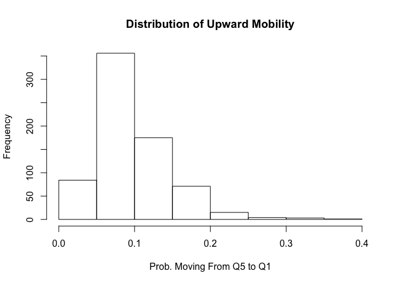
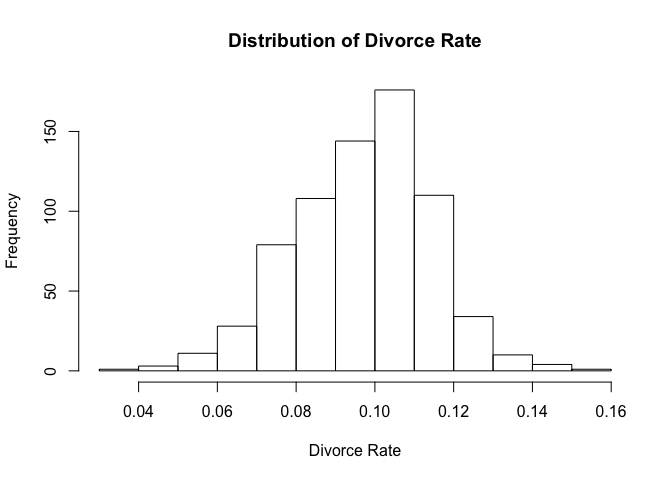
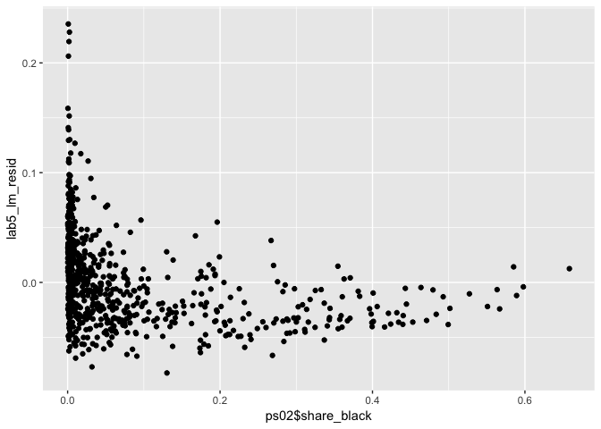
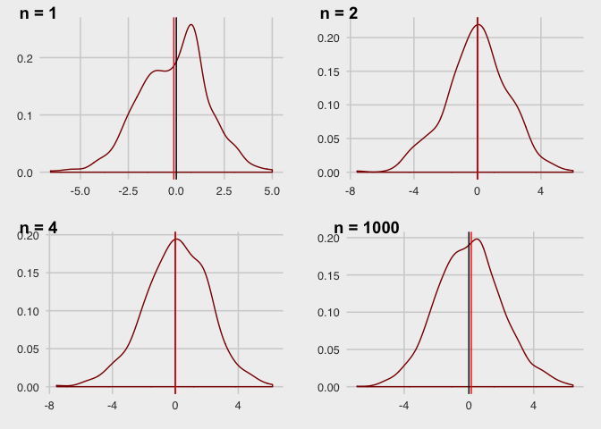
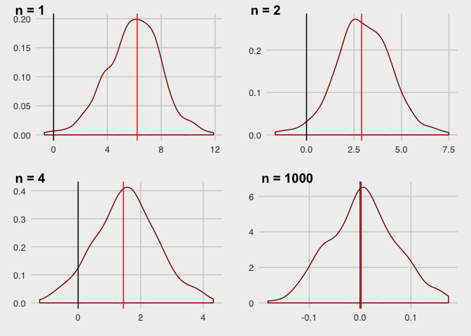

# Homework 2 Help: A short, directed lab

Welcome to Week Five!

Much of what we will do we covered last week, but this lab should give you a focused review that will help you guys get your homework done by Friday.

For your homework, the general topics are: 

 - Unbiasedness vs. Consistency. This is mostly definitions. However, I have a couple of diagrams to illustrate these

 - Heteroscedasticity. This was the primary focus of last lab's math, but we'll do a quick example to help you out.

 - Data and Heteroscedasticity. We'll go over some ways to do actual applications

## Lesson 0: As always, load some data.

 - We're going to load your PS02 data, just to be sure you can do that. We'll also load our packages

use pacman to install/load our data


```r
library(pacman)
p_load(tidyverse, magrittr, lfe, ggplot2, broom, estimatr)
```

Alternatively, if pacman isn't working

```r
install.packages("magrittr")
library(tidyverse)
library(magrittr)
```

Now we need to read our data into our workspace

*Note:* you can find your homework data's filepath on mac by right clicking the file, holding down alt and using the 'copy as filepath' option.

on windows, you can find your filepath by right-click -> properties and then copying the 'location'

Let's read in some data


```r
ps02 <- read_csv(my_filepath)
```

```
## Parsed with column specification:
## cols(
##   prob_q5_q1 = col_double(),
##   i_urban = col_double(),
##   share_black = col_double(),
##   share_middleclass = col_double(),
##   share_divorced = col_double(),
##   share_married = col_double()
## )
```

Okay, how do we explore a dataset? We need to know what we have here, so we'll go to our tried and true strategy:

## Lesson 1: Exploring the Data


```r
head(ps02)
```

```
## # A tibble: 6 x 6
##   prob_q5_q1 i_urban share_black share_middlecla… share_divorced
##        <dbl>   <dbl>       <dbl>            <dbl>          <dbl>
## 1     0.0621       1      0.0208            0.548         0.110 
## 2     0.0537       1      0.0198            0.538         0.116 
## 3     0.0731       0      0.0146            0.467         0.113 
## 4     0.0563       1      0.0564            0.504         0.114 
## 5     0.0446       1      0.174             0.500         0.0924
## 6     0.0519       0      0.224             0.538         0.0956
## # … with 1 more variable: share_married <dbl>
```

```r
summary(ps02)
```

```
##    prob_q5_q1         i_urban        share_black        share_middleclass
##  Min.   :0.02210   Min.   :0.0000   Min.   :0.0001596   Min.   :0.2848   
##  1st Qu.:0.06588   1st Qu.:0.0000   1st Qu.:0.0040385   1st Qu.:0.5001   
##  Median :0.08889   Median :0.0000   Median :0.0240551   Median :0.5523   
##  Mean   :0.09761   Mean   :0.4584   Mean   :0.0808788   Mean   :0.5499   
##  3rd Qu.:0.11715   3rd Qu.:1.0000   3rd Qu.:0.0891569   3rd Qu.:0.6082   
##  Max.   :0.35714   Max.   :1.0000   Max.   :0.6583261   Max.   :0.7338   
##  share_divorced    share_married   
##  Min.   :0.03950   Min.   :0.3729  
##  1st Qu.:0.08513   1st Qu.:0.5444  
##  Median :0.09818   Median :0.5781  
##  Mean   :0.09710   Mean   :0.5726  
##  3rd Qu.:0.10861   3rd Qu.:0.6047  
##  Max.   :0.15618   Max.   :0.6947
```

This set of commands gets us most of what we need. However, we also need the number of observations. We can do that with `nrow()`


```r
nrow(ps02)
```

```
## [1] 709
```

Great. Now, onto some graphing. 

## Lesson 1: Histograms for descriptive analysis

Now, one of the things we need to do is plot a histogram of a function. How do we do that?

- first, let's look at the distribution of upward mobility


```r
#histogram will take many arguments, some of them aren't needed but increase the polish of our graphs. 
#In this case, I provided a main title name (main argument) and a new label for the x axis. 
#If I hadn't, our x-axis would be labeled as ps02$prob_q5_q1.

hist(ps02$prob_q5_q1, main = "Distribution of Upward Mobility", xlab = "Prob. Moving From Q5 to Q1")
```

<!-- -->

We needn't be restricted to that variable. We can do the same thing for divorce rates.


```r
hist(ps02$share_divorced, main = "Distribution of Divorce Rate", xlab = "Divorce Rate")
```

<!-- -->


We can do this for other variables as well, whichever we'd like to examine. However, let's looks over how to run our regression. We'll do something similar to the homework, and do some interpretation

## Lesson 2: Regression analysis

 - Step 1: regress upward mobility on some variables. We'll leave out 2. Let's say Urban and middleclass.


```r
lab5_lm <- lm(data = ps02, prob_q5_q1 ~  share_married)
summary(lab5_lm)
```

```
## 
## Call:
## lm(formula = prob_q5_q1 ~ share_married, data = ps02)
## 
## Residuals:
##       Min        1Q    Median        3Q       Max 
## -0.082513 -0.029657 -0.007428  0.020460  0.235473 
## 
## Coefficients:
##               Estimate Std. Error t value Pr(>|t|)    
## (Intercept)   -0.19845    0.01960  -10.13   <2e-16 ***
## share_married  0.51708    0.03412   15.16   <2e-16 ***
## ---
## Signif. codes:  0 '***' 0.001 '**' 0.01 '*' 0.05 '.' 0.1 ' ' 1
## 
## Residual standard error: 0.04174 on 707 degrees of freedom
## Multiple R-squared:  0.2452,	Adjusted R-squared:  0.2442 
## F-statistic: 229.7 on 1 and 707 DF,  p-value: < 2.2e-16
```
 
 - Step 2. Thinking. What intuition can we get from our intercept term? Does this term make sense?
 - Step 3. Do we have any bias in our coefficients? Where might it come from? (excluded variables?)
What about efficiency?

How would we know? Well, we'd need to see the errors to figure that out for sure, and at least do a due dilligence test to check for heteroskedasticity. Let's start with a plot


```r
#the resid() command lets us retrieve residuals
lab5_lm_resid <- resid(lab5_lm)
#qplot comes from ggplot2 (so make sure that package installed correctly). You could also use plot()
qplot(x = ps02$share_black, y = lab5_lm_resid)
```

<!-- -->

Ok. That looks like we may have some heterskedasticity. What next? We should probably formally test this.

Breusch-pagan tests! If you forgot how this works, go check the notes from [last time](http://rpubs.com/Clennon/Lab4), but we'll do a quick runthrough now.

 - step i through step ii, run a regression and record residuals. We already did this!
 - step iii. Run a regression of your model on squared errors. Let's do that here.

```r
lab5_lm_BP <- lm(data = ps02, lab5_lm_resid ^ 2 ~  share_married)
```
 - step iv: Now that we have a regression object, we need to record R^2
 

```r
lab5_r2.BP <- summary(lab5_lm_BP)$r.squared
```
 - step v: plug our step 4 value into a chisquared to get a p-val, using n*R-squared. Let's see what that looks like.

```r
pchisq(q = nrow(ps02)*lab5_r2.BP, df = 1, lower.tail = F)
```

```
## [1] 7.149603e-05
```
 
 - step vi: state our test results.
 
What can we say? 

Ok: we have an issue. So, what are our options. We either can use a,

1.) functional form change

2.) Heteroskedasticity robust se

Let's look at option #2.

## Lesson 3: HC robust errors

let's go through this again, we can use the `felm()` command from the `lfe` package. It takes a formula much like lm.


```r
#felm() works identically to lm() from the user perspective
lab5_lm_robust <- felm(data = ps02, prob_q5_q1 ~ share_black + share_divorced + share_married)
```
now let's compare our standard errors


```r
summary(lab5_lm_robust, robust = TRUE)
```

```
## 
## Call:
##    felm(formula = prob_q5_q1 ~ share_black + share_divorced + share_married,      data = ps02) 
## 
## Residuals:
##       Min        1Q    Median        3Q       Max 
## -0.080385 -0.022638 -0.005092  0.015201  0.218862 
## 
## Coefficients:
##                 Estimate Robust s.e t value Pr(>|t|)    
## (Intercept)     0.073236   0.021573   3.395 0.000725 ***
## share_black    -0.157198   0.009482 -16.578  < 2e-16 ***
## share_divorced -1.045478   0.098677 -10.595  < 2e-16 ***
## share_married   0.242066   0.033723   7.178  1.8e-12 ***
## ---
## Signif. codes:  0 '***' 0.001 '**' 0.01 '*' 0.05 '.' 0.1 ' ' 1
## 
## Residual standard error: 0.03453 on 705 degrees of freedom
## Multiple R-squared(full model): 0.485   Adjusted R-squared: 0.4829 
## Multiple R-squared(proj model): 0.485   Adjusted R-squared: 0.4829 
## F-statistic(full model, *iid*):221.4 on 3 and 705 DF, p-value: < 2.2e-16 
## F-statistic(proj model): 229.7 on 3 and 705 DF, p-value: < 2.2e-16
```

```r
summary(lab5_lm)
```

```
## 
## Call:
## lm(formula = prob_q5_q1 ~ share_married, data = ps02)
## 
## Residuals:
##       Min        1Q    Median        3Q       Max 
## -0.082513 -0.029657 -0.007428  0.020460  0.235473 
## 
## Coefficients:
##               Estimate Std. Error t value Pr(>|t|)    
## (Intercept)   -0.19845    0.01960  -10.13   <2e-16 ***
## share_married  0.51708    0.03412   15.16   <2e-16 ***
## ---
## Signif. codes:  0 '***' 0.001 '**' 0.01 '*' 0.05 '.' 0.1 ' ' 1
## 
## Residual standard error: 0.04174 on 707 degrees of freedom
## Multiple R-squared:  0.2452,	Adjusted R-squared:  0.2442 
## F-statistic: 229.7 on 1 and 707 DF,  p-value: < 2.2e-16
```

Ok, notice we have some differences in our standard errors!

 - Quick thought experiment:
Can we interpret these coefficients to be causal? If not, can we still learn something interesting here?
The answer to this question is a bit abstract:

 - "Although our descriptive analysis does not identify the causal mechanisms that determine upward mobility, the publicly available statistics on intergenerational mobility developed here can facilitate research on such mechanisms."


## Bonus Lesson 1: 

Let's leave our data alone for a minute. You don't have to code this, but I want to give you guys some intuition for part 1f on your problem set. In particular, what does an unbiased & inconsistent vs. biased and consistent estimator look like? Why would we want one or another?

To do this, I'm going to simulate my own data. We're going to build one column of a normal variable. But, we'll be using this functionality a LOT. So let's make a `function` to generate this dataframe. You'll learn more about functions soon.


```r
#function() is itself a function. You give it an input (n here) it can play with, and then you provide it an 
#argument it can use to impact our input in some way. The argument is surrounded by brackets {}. Return returns
# the written data frame.

data_gen <- function(n) {
  return(data.frame(
    v1 = rnorm(n,0,2)
  ))
}
```

Now, let's create an *inconsistent but unbiased* estimator.

What exactly does inconsistent mean? What about unbiased? Let's try to estimate the mean of v1

- inconsistent: as N increases, estimator does not necessary converge on true value
- unbiased: E(estimator) = E(estimated)


```r
data_gen(20)
```

```
##            v1
## 1   0.2598334
## 2   3.6582345
## 3   1.4158138
## 4   2.9245912
## 5  -1.2328878
## 6   1.4188064
## 7   0.9682227
## 8  -1.1238103
## 9   3.0140098
## 10  2.2942449
## 11 -0.7444066
## 12  0.9167136
## 13 -1.6867162
## 14 -0.5185459
## 15 -1.4440953
## 16 -0.6299375
## 17  1.5918882
## 18 -1.9049089
## 19 -0.7596121
## 20  0.7329911
```

```r
#We also are going to generate a lot of these dataframes. Let's make a second function
est1 = c()
iter <- function(itr, n) {
  for (i in 1:itr) {
    data<-data_gen(n)
    est1[i] = mean(sample(data$v1,1))
  } 
  return(est1)
}


#This function created an estimator that randomly picks one observation of a variable and uses that to estimate the 
# mean.
```

Does our estimator fit the bill? Is it unbiased? Not consistent? Let's plot it across several N to get a better idea. We can use ggplot here, but use some of its more advanced functions to do so. Ggplot objects are built in layers, where each layer can be a different section of the graph. We'll also use `cowplot` which lets us build an array of graphs.


```r
p_load(ggthemes) #this lets us make our graphs look great with the theme_fivethirtyeight() object.
#We'll build 4 graphs, drawing the distribution of our estimator given a sample size n, estimated 500 times.
#n = 1
p1 <- ggplot(,aes(iter(500,1))) +
  geom_density(color = 'darkred') +
  theme_fivethirtyeight() +
  geom_vline(xintercept = 0) +
  geom_vline(xintercept = mean(iter(500,1)), color = 'red')

#n = 2
p2 <- ggplot(,aes(iter(500,2))) +
  geom_density(color = 'darkred') +
  theme_fivethirtyeight() +
  geom_vline(xintercept = 0)+
  geom_vline(xintercept = mean(iter(500,2)), color = 'red')

#n=4
p3 <- ggplot(,aes(iter(500,4))) +
  geom_density(color = 'darkred') +
  theme_fivethirtyeight() +
  geom_vline(xintercept = 0)+
  geom_vline(xintercept = mean(iter(500,4)), color = 'red')

#n = 1000
p4 <- ggplot(,aes(iter(2000,1000))) +
  geom_density(color = 'darkred') +
  theme_fivethirtyeight() +
  geom_vline(xintercept = 0)+
  geom_vline(xintercept = mean(iter(500,1000)), color = 'red')

#let's plot these guys together.
p_load(cowplot)
plot_grid(p1, p2, p3, p4, 
          labels = c("n = 1", "n = 2", "n = 4", 'n = 1000'),
          ncol = 2, nrow = 2)
```

<!-- -->


now, to hurry things along, let's do our other option. Consistent but biased. That means, as n-> infinity, we are converging on beta, but E(estimator) isn't equal to our E(estimated). What kind of function would do that? Well...

 - Here's an example: estimator = mean(data) + 6/n. It will always be biased, but it will converge.
 

```r
est2 = c()
iter2 <- function(itr, n) {
  for (i in 1:itr) {
    data<-data_gen(n)
    est2[i] = mean(data$v1)+6/n
  }
  return(est2)
}
```

Now let's look at this new estimator at different n


```r
#n = 1
p1 <- ggplot(,aes(iter2(500,1))) +
  geom_density(color = 'darkred') +
  theme_fivethirtyeight() +
  geom_vline(xintercept = 0) +
  geom_vline(xintercept = mean(iter2(500,1)), color = 'red')

#n = 2
p2 <- ggplot(,aes(iter2(500,2))) +
  geom_density(color = 'darkred') +
  theme_fivethirtyeight() +
  geom_vline(xintercept = 0)+
  geom_vline(xintercept = mean(iter2(500,2)), color = 'red')

#n=4
p3 <- ggplot(,aes(iter2(500,4))) +
  geom_density(color = 'darkred') +
  theme_fivethirtyeight() +
  geom_vline(xintercept = 0)+
  geom_vline(xintercept = mean(iter2(500,4)), color = 'red')

#n = 1000
p4 <- ggplot(,aes(iter2(500,1000))) +
  geom_density(color = 'darkred') +
  theme_fivethirtyeight() +
  geom_vline(xintercept = 0)+
  geom_vline(xintercept = mean(iter2(500,1000)), color = 'red')

#let's plot these guys together.
library(cowplot)
plot_grid(p1, p2, p3, p4, 
          labels = c("n = 1", "n = 2", "n = 4", 'n = 1000'),
          ncol = 2, nrow = 2)
```

<!-- -->


So, now that you've seen this, which option would you choose? The choice is more complicated than you think, so definitely spend some time on this. The homework question itself is mostly about how much thought you put into your answer, but this question actually has a great deal of value if you see yourself going into data anlaysis in the future.

Note that the `echo = FALSE` parameter was added to the code chunk to prevent printing of the R code that generated the plot.
