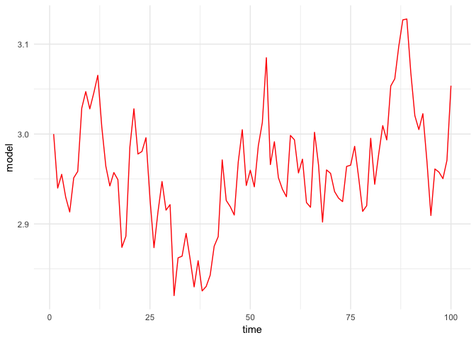
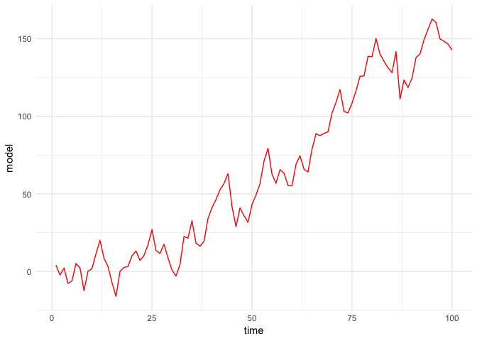
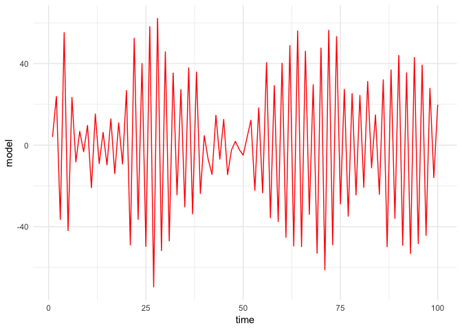

# Week 6 Lab Notes

Welcome to week 6! Welcome back from the midterm. Today, we're going to learn about functions. These notes are going to be a lot more in depth than your lab was, to be sure everyone can learn these skills no matter where you are in your understanding.

Let's start our lecture as we always do: load some packages. Packages, as you'll recall, are functions someone has written for R. For us today, we'll be working with...
- ggplot2 to make amazing data visualizations, 
- tidyverse to help manipulate data, 
- magrittr, which helps us tidy up code, and 
 -pacman which makes managing all of these packages so much simpler.

##Lesson 0: packages

if you haven't already, you can install pacman with the following command: 
`install.packages("pacman",dependencies = T,repos = "http://cran.us.r-project.org")`


```r
library(pacman)
p_load(tidyverse, magrittr, ggplot2)
```

## Lesson 1: Function Basics

Before we talk about functions in R, we should first make sure we understand what a function is in general. 
You all are probably used to thinking of something like:
  
   `f(x)= x^2`

But what really does this even mean? Why is this a useful tool?
 - It takes some input (a number), and gives us an output (in this case, the squared number, which is indeed also a number). We can represent the function $f$ above as:
  
- `Number -> ADifferentNumber` where that arrow is something we call a mapping. A mapping links one object to another. This doesn't *have* to be two numbers, it could be a word and a dataframe, or two words. For instance, I could come up with a function called `color labeler` and then pass it some object, which it will map to a color.

  `color_labeler(banana) = yellow`

Knowing all of this, we need to go back to lecture 1 to remind ourselves about R-facts before we make a function.

- Everything in R has a `name`, and everything is an `object`
- Functions have `inputs`/`arguments` and `outputs`

With these in mind, let's write a function that will take some x, and spit out x^2 + 10. That is, let's write the code for f(x)=x^2+10.

**Everything in R needs a name** That includes our function.  
We do this by starting with a name, setting it equal to a 'function()' function.

In general, this function looks like `function([some_set_of_arguments]){your function code}`. Let's look at an example below.


```r
#function() is a special operator that takes any arguments you want in the parentheses, and then lets you manipulate
#them in any way you see fit. Think of the parenthese here as the toys you're giving your computer to play with in
#the sandbox.
squarePlusten = function(x){
  #tell squarePlusten what to do. x is an input here, we can tell our function to transform our variable into
  #something else.
  x_squaredten = x^2+10
  #Now, in order to make use of this value, we need our function to spit something out. 
  #We do this with another special function, 'return()'. This will stop your function and tell it to spit out
  #whatever object is in the parentheses. In a sense, it's the toy your computer gives back to the rest of your 
  #workspace.
  return(x_squaredten)
}
```

notice however: x_squaredten *isn't equal to anything* now that our function has been run. That's because x_squaredten is only defined in the context of your written function.


```r
x_squaredten
```
Now, let's see what our function can do here.

```r
#check for 10. should be 110
squarePlusten(10)
```

```
## [1] 110
```

A couple things to note

 - Brackets around functions lets R know where the function starts and ends. 
 - Technically we do not need them for one line functions

 - Return: this tells the function what it should return for us. We don't hold onto any temporary objects created while your function runs, though the function can modify objects outside of itself.

Remember, functions don't just change numbers to numbers. A more accurate way to think of functions is as a *map* from one object to another. The starting point is the argument, and the end point is the output. The functions take an object as an input 
                                                                                                                      For example, we can write a function that takes a vector, square all the elements, and then return a plot. In this case, (lets call our function g) does the following:
            
`Vector -> Plot`

We're going to need a new tool for this which I will get to.

### Sapply()
             
So, what should our code do?
 - Take a vector, say c(1,2,3)
 - Square each element of the vector. note that we will need a way to store these results. 
Our first step is to figure out all of our moving parts. Here, we need some set of numbers. We can use vectors with the `c()` command!

Lets store them in a vector called x: `x =  c(1,4,9)`
  
Now, I want a function to return a plot with all of the (x,x^2 = y) pairs affiliated. We can use a special function called `sapply()` which lets us perform a function a whole bunch of times.

`sapply()` is cool. This is how it works: `sapply(some_vector,function)` will take every element in the vector and apply your function to it. We can use this to run a function a whole ton of times all at once.


```r
#build a vector, as we discussed above
x = c(1,4,9)
#we'll use the sapply, which takes three arguments, an input, an argument to build a new set of values.
plot_sq = function(x){
#now we can use the sapply function as discussed above.
y = sapply(x, function(x) x^2)
#return the plot
return(plot(x=x,y=y))
}
#check that it works
plot_sq(1:3)
```

<!-- -->

We just built our own plotting function! Pretty exciting

## Lesson 2: For Loops
 Note that we could have also written the same thing with a for loop. What is a for loop?
the definition is actually hinted at in the name: the logical flow here is 'for something in a list, do an argument I provide.' A better source:

From wikipedia:

*A for-loop has two parts: a header specifying the iteration, and a body which is executed once per iteration*

Here is an example of how to write a basic for loop:


```r
#we will build an empty vector x, which we will use a for loop to fill in
x=c()
#starting our loop, we're saying that i is an object in 1-10.
for (i in 1:10){
  #dividing 10 by the numbers 1 through 10.
x[i]= 10/i
}
#let's look at what this makes
x
```

```
##  [1] 10.000000  5.000000  3.333333  2.500000  2.000000  1.666667  1.428571
##  [8]  1.250000  1.111111  1.000000
```

i is, for each loop, storing the value in your sequence (here, it's a number in `1:10`) then performing the operation you defined in the loop. Like a function, a for loop defines its "body" by setting the start point with a `{` and an end point with a `}`.

But, what is this doing? Let's do this manually, but for i in 1:3

```r
# start with i equals 1, but first we need an empty vector to fill in.
x_slow = c()
i = 1
x_slow[i] = 10/i
x_slow
```

```
## [1] 10
```

```r
#look now at i = 2. 
i=i+1
x_slow[i] = 10/i
x_slow
```

```
## [1] 10  5
```

```r
#look now at i = 3
i=i+1
x_slow[i] = 10/i
x_slow #and so forth
```

```
## [1] 10.000000  5.000000  3.333333
```

Really though, we can loop over any object we want. Maybe we want to loop over some weird sequence, say `c(2,300,-4,6)` and the loop will perform your object. 

Lets rewrite our function `plot_sq` with a for loop inside it


```r
plot_sqf = function(x){
#initialize y:
  y=c()
  #start our for loop. We're looping over every object in the vector x, so we want to iterate a number of times
  #equal to the length of x so we don't miss any.
  for (i in 1:length(x)) {
    #for each i in the vector i:length, update the ith value in y with:
  y[i] = x[i]^2
  }
#return the plot
return(plot(x=x,y=y))
}

#plot squared values between 1-10
plot_sqf(1:10)
```

<!-- -->

Understanding the loop
  
for (i in 1:length(x)): i does what is called "indexing." My goal for this function is to "loop" through all elements of x, and fill a vector called `y` with the squared elements of x. Hence the loop needs to terminate at the final element of `x`. 

 - `length(x)` gives the # of rows x has.
 - `y[i] = x[i]^2` remember how we index arrays in R: row by column. Thus for each i=1,2.., the iterator fills row `i` in `y` with the squared element of the `ith` row of `x`. 

Let's take a look at the plot and make sure it is the same as our last version with sapply()


```r
plot_sqf(1:3)
```

<!-- -->

Great! But  that graph looked horrible. How should we spruce it up? Great question.

## Lesson 3: ggplot2

ggplot2. We've used this package already, every time you've used qplot, but let's do this better.


I will introduce you to the basics. The *gg* in ggplot refers to the **g**rammar of **g**raphics. This is Hadley Wickham's adoption of Leland Wilkinsons brainchild. There are three principles

 + **Aesthetic mappings**
  -This is the map through which your data is linked to the plot
 + **Geoms**
   -Tells us how the mappings are defined. These could be points, lines, bars, etc
 + **Layers** 
  -This is how we construct our plots: adding different layers of the plot together.

This is sort of hard to get your head around when you first start thinking about it. Some examples will help. See [here](https://r4ds.had.co.nz/data-visualisation.html) for an excellent resource

So: the general idea here is that we build a linking of data through ggplot(), then add layers with the + operator, where these layers can be geometries that could be bar graphs, histograms, scatterplots, whatever you want. They could also be graph themes, new functions, even animation directions.

An example:

Let's make a basic plot using the `starwars` data. This data has information on star wars characters. First, let's see what information we have here.


```r
names(starwars)
```

```
##  [1] "name"       "height"     "mass"       "hair_color" "skin_color"
##  [6] "eye_color"  "birth_year" "gender"     "homeworld"  "species"   
## [11] "films"      "vehicles"   "starships"
```

Cool. Let's plot a basic scatterplot the characters height on their mass:

Let's look at the `ggplot` function. This will be your bread and butter for your visualization. It takes any number of arguments, you'd have to look at the handy [ggplot2 cheatsheet](https://www.rstudio.com/wp-content/uploads/2015/03/ggplot2-cheatsheet.pdf) to know them all. 

In our case, it will usually take a dataset (`starwars`, here) and then an aesthetic mapping. The aesthetic mapping will map variables to axes in a graph, but also can map variables to other things like color, size, or shape. So the general format will be:

`ggplot(data=your_dataset, mapping = aes(x = a_variable, y = a_variable, color = a_variable)) + geom_point()`

Where `geom_point()` will tell R how to draw your visualization.

Ok. Let's do this.


```r
ggplot(starwars,aes(x=height,y=mass)) + geom_point()
```

```
## Warning: Removed 28 rows containing missing values (geom_point).
```

<!-- -->

Who is the outlier? Any guesses?

 - If you guessed Jabba, nice work!

Now lets plot it sans Jabba and make the graph look a bit nicer. This will require a few more layers. We'll filter our data so that we only keep observations with mass less than 1000, and just for fun we'll add a line with standard error bars around it.


```r
#So, we need some layers. Let's filter to get rid of Jabba. The theme layer will let us make things prettier
ggplot(starwars %>% filter(mass<1000),aes(x=height,y=mass))+ 
  geom_point()+geom_smooth(method = "lm", col = "red") +
labs(x= "Mass", y="Height") + theme_minimal()
```

<!-- -->

Great! Now lets return to our function from before and make the plots we produce look a bit nicer, using ggplot.


```r
plot_sq2 = function(x){
#can do this with a for loop as well. sapply applies the function x^2 to all elements of x
y = sapply(x, function(x) x^2)
#return the plot
return(ggplot()+geom_line(aes(x=x,y=y)))
}
```

This will make it so our graph is indeed a connected line.


```r
#check that it works
plot_sq2(-20:20) 
```

<!-- -->

```r
#nice!!
```

Another ggplot2 example

Remember the `Auto` dataset from many weeks ago? Lets take another look. It's in the `ISLR` package so we need to `p_load` that guy.


```r
p_load(ISLR)
#if p_load doesn't work, use below commands.
#install.packages("ISLR",repos = "http://cran.us.r-project.org")
#library(ISLR)
names(Auto)
```

```
## [1] "mpg"          "cylinders"    "displacement" "horsepower"  
## [5] "weight"       "acceleration" "year"         "origin"      
## [9] "name"
```

We can incorporate both colors and size into our aesthetic mappings. This is handy if you want to have three dimensions in your graph. Let me show you what I mean.


```r
#remember, vertical space is ours to take: R doesn't care about it
ggplot(data = Auto)+
  geom_point(aes(x=mpg,y=weight, col= cylinders))
```

<!-- -->

Now by size:


```r
#alpha gives transparency of dots
ggplot(Auto) +
  geom_point(aes(x=mpg,y=weight, size= cylinders), alpha=.3)
```

<!-- -->

Not so hard, right? Incredibly flexible and, compared to most languages it's easy to use!

Back to metrics: Simulating time series data
  
We will now return to econometrics. Why did we learn about all of this? To set up a virtual lab- a simulation! Why do we care about simulations? 

They allow us to mess around with model parameters when we know we don't need to worry about data, because we generated it!

So we will write a function that simulates the model:

`y_t = alpha_o+alpha_1 * y_{t-1} + u_t,  u_t ~ N(0, sigmasq)`

How do we do this? We can use the tools we have just talked about.

1.) Draw $T$ values of $u$, where $T$ is the number of periods we simulate
2.) Set some starting point for y
3.) Generate y data with a for loop, which lets us keep its time-dependent status.

we set up a function that takes an initial value for y, some alphas, a std deviation parameter and a number for our total number of observations


```r
#we start with a function, passing in all of the parameters we'll need.
ts_model = function(y_init,a_0,a_1, sigma, T){
  #our error
  u = rnorm(T,mean =0, sd=sigma )
  #initialize y as a vector
  y = c()
  #set first observation to our provided level
  y[1]= y_init
  #loop through with for
  for (i in 1:T){
  y[i] = a_0+a_1*y[i-1]+u[i]
  }
  #finally, return y
  return(y)


  #let's create a dataframe, declare 3 variables
  ts_data = data.frame(
  time = c(1:T), 
  model=  y)
  return(ts_data)
  #and don't forget to close your function off with a }!
}

ts_model(10,1,.02,.22,22)
```

```
## Error in y[i] <- a_0 + a_1 * y[i - 1] + u[i]: replacement has length zero
```

It didn't work! What happened? Look at the the sequence we are iterating over: `1:T`. What would the first element of y be here?
  
`y[1] = a_0+y[0]+u[1]` What is `y[0]`? R has *no idea*

R starts indexing at 1. This is unusual for coding languages and can trip you up if you don't keep it in mind. So, y[0] is not defined. This should be an easy fix.


```r
ts_model2 = function(y_init,a_0,a_1, sigma, T){
  #draw values of shock
  u = rnorm(T,mean =0, sd=sigma )
  #set up y as a vector
  y =c()
  #initialize y
  y[1]= y_init
  #loop
  for (i in 2:T){
    y[i] = a_0+a_1*y[i-1]+u[i]
  }
  
  ts_data = data.frame(
    time =c(1:T), 
    model=  y)
  
  return(ts_data)
  #create a dataframe for plotting
  
}
```

Now we need to test our data!


```r
#what is our mean y?
mean(ts_model2(3,.39, .87, .04, 100)[,2])
```

```
## [1] 2.999259
```


Now, using ggplot, which we talked about, we can pass the `ts_model2()` function we made, and generate a graph of the process!

```r
ggplot(aes(x = time, y = model), data = ts_model2(3,.39, .87, .04, 100)) +  
  geom_line(col = 'red') +
  theme_minimal()
```

<!-- -->

A quick reminder about AR models:

 - Before you jump into plotting this, you need to be careful. What happens when $|a_1|>=1$?


```r
#make a_1 equal to 1 in ts_model2()
ggplot(aes(x = time, y = model), data = ts_model2(4,.1, 1, 10, 100)) +  
  geom_line( col = 'red') +
  theme_minimal()
```

<!-- -->

This is also a problem when a = -1. It looks a LOT different though:


```r
#make a_1 equal to -1 in ts_model2()
ggplot(aes(x = time, y = model), data = ts_model2(4,.1, -1, 10, 100)) +  
  geom_line( col = 'red') +
  theme_minimal()
```

<!-- -->

Let's turn it up to 11!!!


```r
#make a_1 equal to 11 in ts_model2()
ggplot(aes(x = time, y = model), data = ts_model2(4,.1, 11, 10, 100)) +  
  geom_line( col = 'red') +
  theme_minimal()
```

<!-- -->


 * These processes are **non-stationary**. In other words, it will diverge over time, which means it's hard to predict into the future and may not be a realistic representation of a process.
    
    
* The great thing about simulations is you can see how different parameter values impact your model
 * Sometimes changing a parameter can change the output of your model in a not obvious way
 * I just gave you guys an example below, but mess around with the parameters.
    

  
Another important ability: how can we save this graph for future use?
      


```r
png('#FILE PATH HERE\file_name.png')
```

    
we can clear all plots if our workspace gets messy with `dev.off()`

```r
dev.off()
```

We can also just screenshot from plots or use the save option in the plot window if you prefer.

And that's it for today! I hope this was helpful. I'll add a nice bonus illustration on how to estimate an AR(2) model using real-world data below, but I wanted to get these notes up and running before I got to the bonus portion.
    
## Bonus Section: Estimate an AR(2) process on rGDP growth.

let's look at a regression for this kind of model. We can force our data into a structural form using an 'ar function'

This will be of the AR(2) form, which is just shorthand for

\[y_t = a_0 + a_1*y_{t-1} + a_2*y_{t-2} + u_t\]

Lets load some cool packages. We can access the [FRED's]() data through something called an API. You can get a key to access their data without the hassle of downloading a csv [here](https://research.stlouisfed.org/docs/api/api_key.html). If you're interested in doing this, follow the directions [here](https://github.com/uo-ec607/lectures/blob/master/07-web-apis/07-web-apis.md)

If you're interested in doing this, I reccommend the above tutorials, as well as Grant McDermott's API lecture. For now, if you want the data, you can find it on [the FRED website](https://fred.stlouisfed.org/series/GDPC1). I've loaded this data in already using a read_csv('') command. If you want a reminder on how to do that, go back to [HW help lab number 1.](http://rpubs.com/Clennon/Lab3)


```r
#in case you skipped down to here
library(pacman)
p_load(lmtest)
#I built a dataframe from a read_csv command named gdpc1, which is real gdp (chained)

#also, looking at growth rates necessarily removes our first observation. We'll find change in growth rates
#via a differenced log approach. This will ensure stationarity
gdpc1$ldgdpc1 <- c(0,diff(log(gdpc1$GDPC1), 1, 1))
gdpc1 <- gdpc1[gdpc1$DATE > 1970,]

#isolate our variable of interest (row 3) and first row of time
tsData <- ts(gdpc1[,c(1,3)], start = c(1970,01), frequency = 12)

#let's fit an AR2 using the arima() function           
fitAR2 <- arima(gdpc1[,c(3)], order=c(2,0,0),method="ML")
coefsAR2 <- coeftest(fitAR2)
coefsAR2
```

```
## 
## z test of coefficients:
## 
##             Estimate Std. Error z value  Pr(>|z|)    
## ar1       0.31332256 0.07508481  4.1729 3.007e-05 ***
## ar2       0.11131228 0.07512568  1.4817    0.1384    
## intercept 0.00701693 0.00089869  7.8079 5.813e-15 ***
## ---
## Signif. codes:  0 '***' 0.001 '**' 0.01 '*' 0.05 '.' 0.1 ' ' 1
```


ar(x, aic = TRUE, order.max = NULL,
       method=c("yule-walker", "burg", "ols", "mle", "yw"),
       na.action, series, ...)
                                                                                                                                                                                                                                          What the coeftest outputs looks pretty similar to our usual coefficients. 
                                                                                                                                                                                                                                          
Now, we can see what our model actually looks like for prediction. Our methodology will be to take all of the data, and generate the predictions we'd get from a forecast one period (month) in advance. That is, using the data from 1970-March of 1979, we would predict April of 1979 to see what our forecast would look like.

To do this, we can use a for loop to calculate a leave-one-out forecast for every period.
                                                                                                                                                                                                                                          

```r
#Note: this is an illustration of how you can use the toolset you already have to do a forecast: 
#there are definitely better forecasts for rGDP, and definitely other ways to do this exact process. This is mostly
#to illustrate an application of the tools you've learned so far.


#Using some fun indexing tricks, we can pull the coefficients from our coeftest object from before.
gdpc1$gdppred <- gdpc1$ldgdpc1 
for (i in 10:length(gdpc1$ldgdpc1)-1){
  gdpc1$gdppred[i+1] <- coefsAR2[[3]][1] + coefsAR2[[1]][1]*gdpc1$ldgdpc1[i] + coefsAR2[[2]][1]*gdpc1$ldgdpc1[i-1]
}

ggplot(aes(x = DATE, y = ldgdpc1), data = gdpc1) +  
  geom_line(col = 'red')+ #red is actual change in rgdp growth
  geom_line(col = 'blue', aes(x = DATE, y = gdppred), data = gdpc1) + #blue is one-period-out predicted change
  theme_minimal() +
  labs(x = 'Year-Month', y = 'log-difference in Real GDP')
```

<!-- -->
    
and our MSE of our prediction is:

```r
mean((gdpc1$ldgdpc1-gdpc1$gdppred)^2)
```

```
## [1] 5.423831e-05
```

And that's it for our lab this week. See you guys next week for some more functions and other fun stuff!                                                                                                                                                                                                                    
