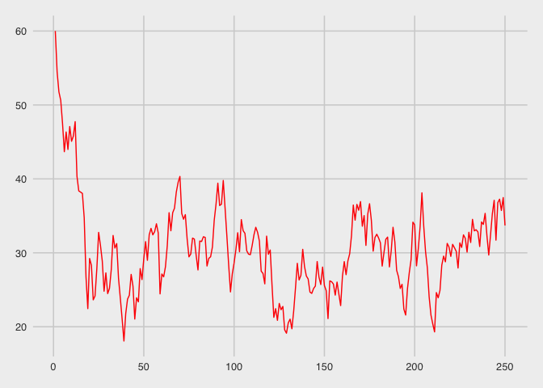
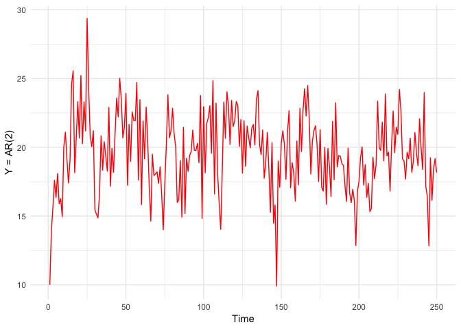
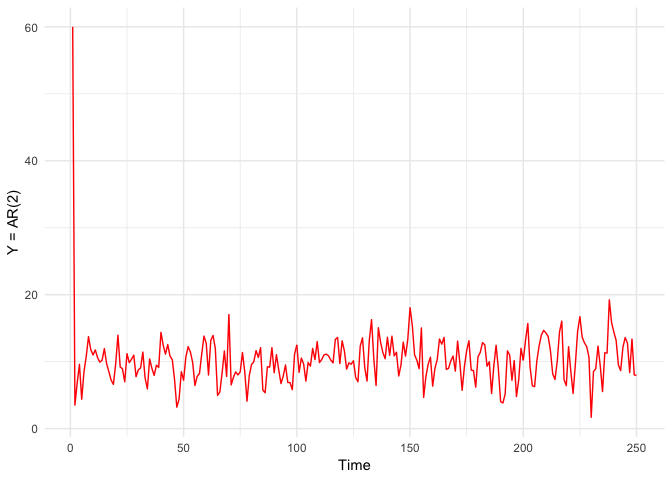

#Week 7: Time Series Review, simulation and functions, plus a bonus section

So, today we are going to do something a little different. Instead of making this lecture purely material where you follow along, we will have a short review lecture and then there will be some practice problems at the end. Let's begin,with our usual...

## Lesson 0: Package loading 

Let's use pacman again. As usual, we can use this package's p_load function.


```r
library(pacman)
p_load(ggplot2,magrittr, tidyverse, ggthemes)
```

Awesome. Let's move onto our first non package lesson.


#Lesson 1: using a function to simulate an adl(1,1) model

Ok, as a review, we are going to take a longer time to go over how to simulate an 'ADL' model.

Let's assume here that we are using adl to estimate some variable y.


You guys learned about this in class, but what does **ADL** stand for?

**A**utocorrelated **D**istributed **L**ag. Let's walk through these terms. 

What does Autocorrelated mean? Autocorrelated: 
 - *Auto*: self, directed from within (Greek). 
 - *Correlated*. Correlated: Mirriam-Webster: *a phenomenon that accompanies another phenomenon, is usually parallel to it, and is related in some way to it*
 
 So in total, this means an ADL model is in some way self-related. In practice, you guys will use autocorrelation to be purely related to time, that is, objects are related to recent observations. However, autocorrelation can also show up in other ways, for instance, in spatial autocorrelation where data that is collected from places close to one another are correlated.

*Distributed Lag*: This is describing some variable x where the impact of x on our outcome y happens over several periods, that is, X_t at t=T and X_t at t=T-1 will BOTH effect y_T. As an example:

Building new roads, for instance, may have an effect today. Maybe we believe that opening some new roads will reduce congestion. However, it's possible that drivers take some time to really start using these roads efficiently, so those new roads will also impact commutes next year too. Let's think of some way of simulating this data, where t is in months, and x will be thousands of dollars invested in roads.

Let's simulate an adl(1,1) model. That means one 'lag' of y and one 'lag' of x. Let's write this out

y_t = b0 + a1y_(t-1) + b1x_t + b2x_(t-1) + u_t

to build a simulation function, we're going to need to build each of these variables. Before we build the function
in full, let's just build y_1.

First, we need our model parameters

**Step 1**: We need to know where our commute time starts. Let's say in our very first month, commutes were an hour on average.

our commute times will be in minutes


```r
#at time 0, our commutes are an hour, ie, they are 60 minutes long
y_0 <- 60
```

**Step 2**: Let's set a constant: for us, we'll expect every year will increase our commutes by 10 minutes, all else equal and aside from whatever our commute time was last period


```r
#commute times are increasing by 10 minutes
b0 <- 10
```

**Step 3**: However, we know that next month's average commute is PROBABLY related to last month's commute. To model this, we need an 'a1' coefficient, which will determine how any month's commute will change a future month's commute


```r
a1 <- 5/6 #5/6 of last year's commute will impact this month's commute
```

**Step 4**: We need to figure out the effect of investment in roads on our commute times.

Let's say this month, a thousand dollars invested in roads reduces average commute times by 20 seconds.


```r
#-1/6 of a minute corresponds to a decrease of 20 seconds for every 1000 dollars increase (ie, when X increases by 1.)
b1 <- -1/6
```

and next month, every thousand dollars will reduce average commute times by 40 seconds


```r
b2 <- -1/3
```

**Step 5**: Now we need our data.

x_0, x_1, and u are what we need to calculate, but do simulate these we need to make some assumptions on the data. We will assume that dollars spent on roads is not correlated over time. So X0 and X1 will be two draws from a normal distribution. We get to pick the parameters for this. Let's say on average we spend 10,000 dollars or 10*1000 dollars (ie, the mean for x will be 10,)

rnorm takes 3 arguments, number of draws(creates a vector of this size), a mean, and a standard deviation (sd)


```r
x <- rnorm(2,mean = 10, sd = 2.5)
#to check that we made 2 xs here,
length(x)
```

```
## [1] 2
```

great! Now we do the same thing to generate our error u. Let's say our error is mean 0, standard deviation 10. Our error only needs 1 draw, and has a standard deviation of 10 minutes.


```r
u <- rnorm(1,mean = 0, sd = 10)
```

Now we get to make y_1! What does this look like? Let's look

**y_t = b0 + a1*y_(t-1) + b1*x_t + b2*x_(t-1) + u_t**

So we can use this to create y_1.


```r
y_1 = b0 + a1*y_0 + b1*x[2] + b2*x[1] + u
#let's look at our results: how many minutes have we shaved off commute times on average?
print(paste0('Commutes have fallen by ', y_0 - y_1, ' minutes.'))
```

```
## [1] "Commutes have fallen by 32.0416726444027 minutes."
```

```r
#after investing
print(paste0('After investing ', sum(x)*1000, ' dollars in roads'))
```

```
## [1] "After investing 16321.5181958287 dollars in roads"
```

so, according to our model, next month our commutes will change! But what about over a longer period, how would we examine how our commute times change?

We can build a data simulating function! Let's remember how to do this. A function is an object assigned to a name with the `function()` function. In the `()` we put any arguments we want out function to work with.

now, we need to automate our process above, so we need to give our function ALL of the variables above as parameters. That means we need an initial value of y for y_0, all of our coefficients, a mean and standard error for our road expenditures, a standard error for our error term, and some timeframe of interest, T. In total, that means we need 9 different values. Phew!


```r
adl11 <- function(y_0,b_0,a1,b1,b2, sigma_u,mean_x, sigma_x, T){
  #draw values of shock, using our function parameter sigma_u
  u = rnorm(T,mean =0, sd=sigma_u)
  #set up y as an empty vector so we can start placing objects inside of it.
  y =c()
  #initialize y_0 with our user-provided y_0 parameter above
  y[1]= y_0
  #build X
  x = rnorm(T,mean = mean_x, sd = sigma_x)
  #We can use a for loop to build our set of ys
  #recall, i is the index, and will iterate (count) over our set which here is 2 through T (which we provided)
  for (i in 2:T){
    #for every i in the series from 2,3,...,T-1,T, generate a y dependent on last month's y and road expenditures
    #in the last two periods. Written out in r, where the 'i' in x[i] is calling the i'th object in vector x...
    y[i] = b_0+a1*y[i-1]+b1*x[i] + b2*x[i-1] + u[i]
  }
  #now that we have y, we need to return our dataframe
  adl_data = data.frame(
    #create a time vector <1,2,3,...,T-1,T>
    time =c(1:T), 
    average_commute =  y,
    road_spend = x)
  
  #in order to get this object BACK, let's return the created dataframe.
  return(adl_data)
}
```

now, let's plot using ggplot! Remember, we build ggplots using layers of aesthetic mappings, geoms and other objects, seperating them with the `+` operator.


```r
#Generally, when running a simulation you want to 'set a seed.' This forces the random draws you see to be reproducible by another researcher who is trying
#to replicate your work.
set.seed(42)

#Let's build a dataframe we can reference, using our adl11 function we just made:
dadl <- adl11(y_0 = 60, b_0= 10,a1 = 5/6,b1= -1/6, b2 = -1/3, sigma_u =2.5,
      mean_x = 10, sigma_x = 2.5, T = 250)

#Now, we can plot this dataframe using ggplot and layers.
ggplot(aes(x = time, y = average_commute), data = dadl) + 
  geom_line(col = 'red') + #draw our red line
  labs(xlab = 'Months', ylab = 'Average Commute Time (Minutes)') +
  theme_fivethirtyeight() #add a theme to jazz it up
```

<!-- -->

and let's see where we ended up after 250 months (~20 years) of investing in these roads...since our function returns a dataframe, how do we call the T'th observation from the average_commute column?


```r
dadl[250,2]
```

```
## [1] 33.70238
```

after all this time, our average commute fell to (insert your own code's finding here) minutes! In this case, we're seeing 33.70238 minutes!

Now, how would you guys find the minimum or average commute time over our study period? What about just general descriptors in general? Summary!


```r
summary(dadl)
```

```
##       time        average_commute   road_spend    
##  Min.   :  1.00   Min.   :18.07   Min.   : 3.250  
##  1st Qu.: 63.25   1st Qu.:26.49   1st Qu.: 8.275  
##  Median :125.50   Median :30.25   Median : 9.905  
##  Mean   :125.50   Mean   :30.54   Mean   : 9.901  
##  3rd Qu.:187.75   3rd Qu.:33.42   3rd Qu.:11.571  
##  Max.   :250.00   Max.   :60.00   Max.   :17.415
```

What about the month in which our commute times hit the minimum?


```r
#Minimum times can be found by passing a logical where all values are equal to false except where average_commute is at its minimum
dadl[dadl$average_commute == min(dadl[,2]),]
```

```
##    time average_commute road_spend
## 39   39         18.0696      4.717
```
What about the second smallest?


```r
#Minimum times can be found by passing a logical where all values are equal to false except where average_commute is at its minimum
secondbest <- filter(dadl, !(average_commute == min(dadl[,2])))

secondbest %>% filter(average_commute == min(secondbest[,2]))
```

```
##   time average_commute road_spend
## 1  129        19.12873   10.33467
```
Now, some excercises for you guys to try on your own, with solutions provided.

## Questions:

**Question 1.**
<br>

*Write a function that; given a value b, null hypothesis of your choosing (b_0), and a standard error, computes a t-statistic for a regression coefficient*

*Hint: The formula for the t-stat is: t = b-b_0/SE_b*

<br>
<br>
<br>
<br>
<br>
<br>
<br>
<br>
<br>
<br>
<br>
<br>
<br>
<br>
<br>
<br>
<br>
<br>
<br>
<br>
<br>
<br>
<br>
<br>

*An Answer:*

```r
t_stat_func <- function(b,b_0,se){
  t<-(b-b_0)/se
  return(t)
}
t_stat_func(3,2,.024)
```

```
## [1] 41.66667
```


**Question 2.** 
<br>
*Write a function that simulates an AR(2) or MA(2) process, whichever you prefer, and then plot that function*

*Hint: an AR(2) process takes the form: y_t = b0 + b1\*y_(t-1) + b2\*y_(t-2) + u_t and a MA(2) process takes the form: y_t = b0 + b1\*u_(t-1) + b2\*u_(t-2) + u_t*

*Hint2: Remember, R will NOT index at 0.*

<br>
<br>
<br>
<br>
<br>
<br>
<br>
<br>
<br>
<br>
<br>
<br>
<br>
<br>
<br>
<br>
<br>
<br>
<br>
<br>
<br>
<br>
<br>
<br>
<br>
<br>
<br>
<br>
<br>
<br>
<br>
<br>
<br>
<br>
<br>
<br>
<br>
<br>
<br>
<br>
<br>
<br>
<br>
<br>
<br>
<br>
<br>
<br>

*Answers to both: If you got stuck on one, I suggest looking at the AR2 model and then trying to write the MA2 model on your own*

Autoregressive 2 model


```r
ar2 <- function(y_0,b_0,a1,a2, sigma_u, T){
  u = rnorm(T,mean =0, sd=sigma_u)
  y =c()
  y[1]= y_0
  #we don't know y at -1. Let's assume it's 0. You could pick anything.
  y[2] = b_0 + a1*y[1] + b2*0 + u[2] 
  #so we need to start at t=3, creating y[2] manually
  for (i in 3:T){
    y[i] = b_0+a1*y[i-1]+ a2*y[i-2] + u[i]
  }
  #now that we have y, we need to return our dataframe
  ar2_data = data.frame(
    #create a time vector <1,2,3,...,T-1,T>
    time =c(1:T),
    #attach it to our sequence y
    model =  y)
  
  #in order to get this object BACK, let's return the created dataframe.
  return(ar2_data)
}

ggplot(aes(x = time, y = model), data = ar2(y_0 = 10, b_0= 10,a1 = 1/6,a2= 1/3, sigma_u =2.5, T = 250)) +  #phew that was a long one
  geom_line(col = 'red') + #draw our red line
  labs(x = 'Time', y = 'Y = AR(2)') +
  theme_minimal() #add a theme to jazz it up
```

<!-- -->

<br>
<br>
<br>
<br>
<br>
<br>
<br>
<br>
<br>
<br>
<br>
<br>
<br>
<br>
<br>
<br>
<br>
<br>
<br>
<br>
<br>
<br>
<br>
<br>

*Answer for MA2*

Moving Average 2 model

```r
ma2 <- function(y_0,b_0,u1,u2, sigma_u, T){
  u = rnorm(T,mean =0, sd=sigma_u)
  y =c()
  y[1]= y_0
  #we don't know our error at t = -1.
  y[2] = b_0 + u1*u[1] + u2*0 + u[2] 
  #so we need to start at t=3, creating y[2] manually
  for (i in 3:T){
    y[i] = b_0+u1*u[i-1]+u2*u[i-2] + u[i]
  }
  #now that we have y, we need to return our dataframe
  ma2_data = data.frame(
    #create a time vector <1,2,3,...,T-1,T>
    time =c(1:T),
    #attach it to our sequence y
    model =  y)
  
  #in order to get this object BACK, let's return the created dataframe.
  return(ma2_data)
}

ggplot(aes(x = time, y = model), data = ma2(y_0 = 60, b_0= 10,u1 = .4 ,u2= .1, sigma_u =2.5, T = 250)) +  #phew that was a long one
  geom_line(col = 'red') + #draw our red line
  labs(x = 'Time', y = 'Y = AR(2)') +
  theme_minimal() #add a theme to jazz it up
```

<!-- -->


**Question 3**
<br>
Using the gapminder dataset, create a plot of something interesting (to you) using `ggplot2`. In particular, look at the [ggplot2 cheatsheet](https://www.rstudio.com/wp-content/uploads/2015/03/ggplot2-cheatsheet.pdf) and make a cool plot. Alternatively, you can use this starter [ggplot2 tutorial](https://datacarpentry.org/R-ecology-lesson/04-visualization-ggplot2.html) to help. To load this data:


```r
p_load(gapminder)
```

or... you can ignore pacman and make me cry by coding:
`install.packages("gapminder",repos = "http://cran.us.r-project.org")` 
Followed by,

`library(gapminder)`

And, just to get you started, we should always take a look at what variables we have


```r
names(gapminder)
```

```
## [1] "country"   "continent" "year"      "lifeExp"   "pop"       "gdpPercap"
```

I'll post something interesting when I get a bit of time to play around with gapminder.

That was lab for this week. I hope you guys have a great weekend and I'll see you next Thursday.
