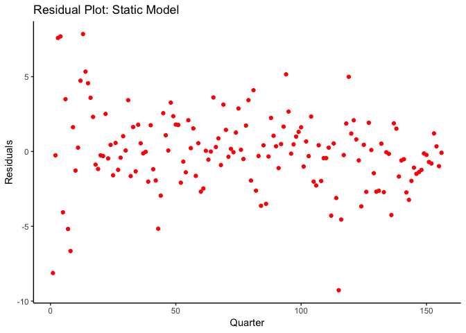
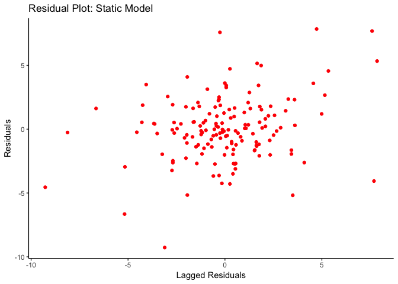
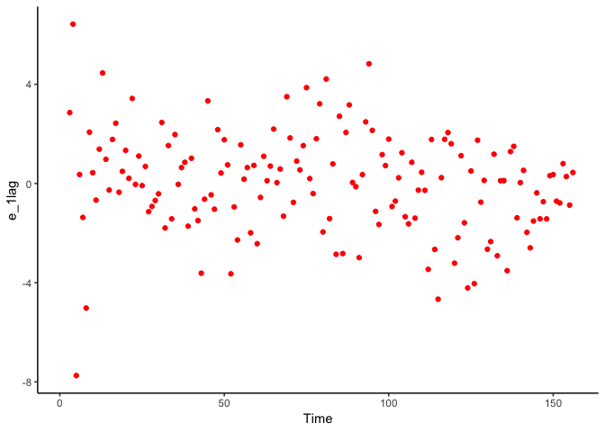
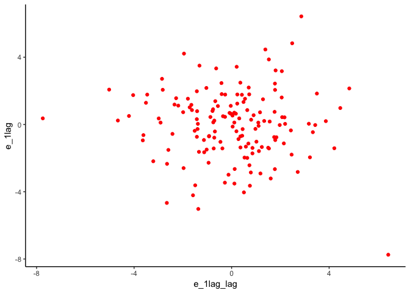
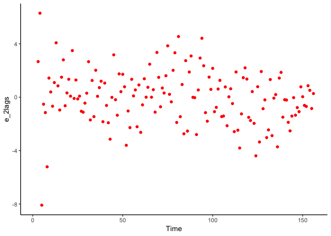
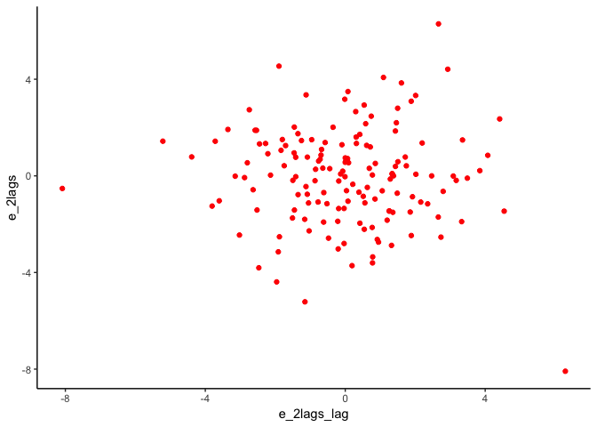
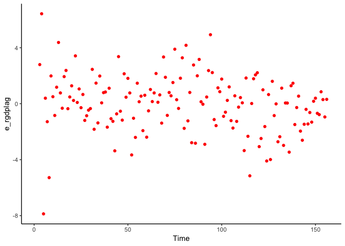

Hi guys, Welcome to week 8!

This set of activities is designed to help you learn the functions you'll be using in your homework 
set, which will be assigned to you soon.

Of course, we're going to start as we always do, loading some packages.

Our first package we want to add to our usual set is the 'lmtest' package which gives us access to
the waldtest function - you guys saw this in class, but we'll walk through how to use it in regards
to your homework.

## Lesson 0: Packages
If you need it: `install.packages("pacman",dependencies = T,repos = "http://cran.us.r-project.org")`


```r
library(pacman)
p_load(tidyverse, magrittr, ggplot2, lmtest, broom)
```


## Lesson 0.5: Load the Data

We've done this bit before, but just to separate it out a bit, let's use `read_csv()` to load the data. This data is currently on canvas, but you can get it from the [FRED's website](https://fred.stlouisfed.org/) too.


```r
freddat <- read_csv("/Users/connor/Dropbox/EC421_Lab/week8/GDPData.csv")
```

```
## Parsed with column specification:
## cols(
##   DATE_qrtr = col_character(),
##   rGDP = col_double(),
##   CPIAUCSL_PC1 = col_double(),
##   PAYEMS_PC1 = col_double(),
##   IndProd = col_double(),
##   WeeklyWage = col_double(),
##   Time = col_double()
## )
```

```r
names(freddat)
```

```
## [1] "DATE_qrtr"    "rGDP"         "CPIAUCSL_PC1" "PAYEMS_PC1"  
## [5] "IndProd"      "WeeklyWage"   "Time"
```

This data was very recently downloaded (Late May, 2019) and comes from the St. Louis Federal Reserve bank.

On your own, examine the data and figure out the time frequency. If you notice, the `date` column is in days, but the observations are occurring every quarter.

let's talk about these variables. I renamed some of these variables to make them more readible. 


 - rGDP: real gdp
 - Date: date 
 - PAYEMS_PC1: Chained Price Index, ie, inflation 
 - IndProd: Industrial Production
 - Weekly Wage: Average weekly takehome pay for a worker 
 - PAYEMS_PC1: Number on payrolls. 
 
 *Note:* All of these variables are in percent change from last period.
 
 *Note 2:* We can rename the variables in a dataframe by using the `names(your_df)` command, and passing a vector of strings, like so
 
 `names(df) <- c('name1','name2','name3')`

## Lesson 1: Running OLS: static model

What is the difference between a *dynamic* or a *static* model?

A *static* model assumes that the impact of any given variable is only effecting the outcome today, whereas *dynamic* implies that the variable impacts the outcome tomorrow. Let's take a look at this:

Let's try to estimate the following static model:

`rGDP = B0 + B1*CPI + B2*Employment u_t`

To do this in R is straightfoward, we can use the `lm` command.


```r
static_model = lm(rGDP ~PAYEMS_PC1 + CPIAUCSL_PC1 ,data=freddat)
tidy(static_model)
```

```
## # A tibble: 3 x 5
##   term         estimate std.error statistic       p.value
##   <chr>           <dbl>     <dbl>     <dbl>         <dbl>
## 1 (Intercept)     2.46     0.387       6.34 0.00000000241
## 2 PAYEMS_PC1      0.644    0.123       5.25 0.000000512  
## 3 CPIAUCSL_PC1   -0.196    0.0902     -2.17 0.0314
```

What does this say? Well first off, it looks like inflation decreases real gdp. Great! Call the central Bank and tell them to stop printing all that money! Back to the gold-standard. Dust off your cowboy hats- [We're gonna go find mr. pocket.](https://www.youtube.com/watch?v=WUUytUkMGO0) Spoiler warning if you haven't seen The Ballad of Buster Scruggs.

Also, employment increases rgdp! 

Hold on a minute, let's put our economists hats back on. Why would contemporary inflation decrease **REAL** GDP?

Maybe we have a different story here if we introduce dynamics to our model.

## Lesson 2: Dynamic version, estimating a dynamic model

Now suppose you believe real gdp percent change from last period might depend on the rgdp from today and yesterday.In other words, we are are interested in estimating the following model:

`rGDP_t = B0+B1employment_t+ B2employment_t-1 + + B3employment_t-2 + B4*CPI_t + B5*CPI_t-1 + u_t.`

But why stop at 1 lag for CPI? Maybe there's a longer-lasting impact, so let's go ahead and estimate a model with two lags of CPI as well.

To do this, we need to use a 'lagged' version of CPI and employment, a set of variables which we do not currently have in our data-frame. As a note: lags is just a fancy way of saying a version of a variable from before t.

You have a few options to do this:

 + Create a new variable $employment_{t-1}$ and add it to our dataframe, then do the regression
 + Run the regression directly. 

Lets run with option one, and then two:

### Option 1


```r
freddat$rgdp_l1 = c(NaN, na.omit(lag(freddat$rGDP,1)))
freddat$emp_l1 = c(NaN,na.omit(lag(freddat$PAYEMS_PC1,1)))
freddat$emp_l2 = c(NaN, NaN, na.omit(lag(freddat$PAYEMS_PC1,2)))
freddat$CPI_l1 = c(NaN, na.omit(lag(freddat$CPIAUCSL_PC1,1)))
freddat$CPI_l2 = c(NaN, NaN, na.omit(lag(freddat$CPIAUCSL_PC1,2)))
```

Then you can run your regression by passing these variables into an LM object. Alternatively, you can pass these lagged values directly to aregression object.

### Option 2

```r
rgdp_1lag = lm(rGDP~ PAYEMS_PC1 + lag(PAYEMS_PC1,1) + 
                 lag(PAYEMS_PC1, 2) + CPIAUCSL_PC1 + lag(CPIAUCSL_PC1,1),
               data= freddat)

summary(rgdp_1lag)
```

```
## 
## Call:
## lm(formula = rGDP ~ PAYEMS_PC1 + lag(PAYEMS_PC1, 1) + lag(PAYEMS_PC1, 
##     2) + CPIAUCSL_PC1 + lag(CPIAUCSL_PC1, 1), data = freddat)
## 
## Residuals:
##     Min      1Q  Median      3Q     Max 
## -7.7449 -1.3343  0.1498  1.2254  6.4257 
## 
## Coefficients:
##                      Estimate Std. Error t value Pr(>|t|)    
## (Intercept)            1.9231     0.3363   5.719 5.74e-08 ***
## PAYEMS_PC1             4.0527     0.5502   7.366 1.14e-11 ***
## lag(PAYEMS_PC1, 1)    -4.7427     0.9618  -4.931 2.17e-06 ***
## lag(PAYEMS_PC1, 2)     1.2887     0.5208   2.475   0.0145 *  
## CPIAUCSL_PC1           0.1885     0.2667   0.707   0.4807    
## lag(CPIAUCSL_PC1, 1)  -0.1793     0.2507  -0.715   0.4757    
## ---
## Signif. codes:  0 '***' 0.001 '**' 0.01 '*' 0.05 '.' 0.1 ' ' 1
## 
## Residual standard error: 2.078 on 148 degrees of freedom
##   (2 observations deleted due to missingness)
## Multiple R-squared:  0.4329,	Adjusted R-squared:  0.4138 
## F-statistic:  22.6 on 5 and 148 DF,  p-value: < 2.2e-16
```

So now CPI has no effect? That makes some sense, given we are looking at RGDP. But that's not consistent with our last model. So what happened? Where did our significance on our CPI go? So changes in employment are causing all of our variation now? 

Let's add one more lag of CPI, and see what happens


```r
rgdp_2lag = lm(rGDP~ PAYEMS_PC1 + lag(PAYEMS_PC1,1) + 
                 lag(PAYEMS_PC1, 2) + CPIAUCSL_PC1 + lag(CPIAUCSL_PC1,1) + lag(CPIAUCSL_PC1,2),
               data= freddat)

summary(rgdp_2lag)
```

```
## 
## Call:
## lm(formula = rGDP ~ PAYEMS_PC1 + lag(PAYEMS_PC1, 1) + lag(PAYEMS_PC1, 
##     2) + CPIAUCSL_PC1 + lag(CPIAUCSL_PC1, 1) + lag(CPIAUCSL_PC1, 
##     2), data = freddat)
## 
## Residuals:
##     Min      1Q  Median      3Q     Max 
## -8.0870 -1.2281  0.0325  1.3140  6.2913 
## 
## Coefficients:
##                      Estimate Std. Error t value Pr(>|t|)    
## (Intercept)            1.8691     0.3337   5.602 1.01e-07 ***
## PAYEMS_PC1             3.8648     0.5518   7.005 8.26e-11 ***
## lag(PAYEMS_PC1, 1)    -4.1754     0.9902  -4.217 4.31e-05 ***
## lag(PAYEMS_PC1, 2)     0.9323     0.5432   1.716   0.0882 .  
## CPIAUCSL_PC1           0.2774     0.2673   1.038   0.3010    
## lag(CPIAUCSL_PC1, 1)  -0.7934     0.3871  -2.049   0.0422 *  
## lag(CPIAUCSL_PC1, 2)   0.5217     0.2525   2.066   0.0406 *  
## ---
## Signif. codes:  0 '***' 0.001 '**' 0.01 '*' 0.05 '.' 0.1 ' ' 1
## 
## Residual standard error: 2.055 on 147 degrees of freedom
##   (2 observations deleted due to missingness)
## Multiple R-squared:  0.4489,	Adjusted R-squared:  0.4265 
## F-statistic: 19.96 on 6 and 147 DF,  p-value: < 2.2e-16
```

Okay, this is feeling a bit insane. Maybe we should do a few more tests?

What do we do now? An F-test - by restricting our coefficients on that second lag, we can see how important that lag is!

## Lesson 3: F-tests

Lets run an F-test to compare our two models. To do this in R, we need a regression (lm) object. Let's use rgdp_2lag. For clarity sake, I'll recreate the object below.


```r
rgdp_2lag = lm(rGDP~ PAYEMS_PC1 + lag(PAYEMS_PC1,1) + lag(PAYEMS_PC1, 2) + 
                 CPIAUCSL_PC1 + lag(CPIAUCSL_PC1,1) + lag(CPIAUCSL_PC1,2),
               data= freddat)
```

Now we bring in the lmtest package for waldtest. You can omit the lmtest:: for your purposes, its there just to explicitly state which package the command uses

lmtest::waldtest(rgdp_2lag,c("lag(CPIAUCSL_PC1, 2)"), test="F")

Now, on your own, using one of the techniques describes above I want you to estimate the model above, replacing CPI with a lag of rGDP:

`rGDP_t = B0+B1*CPI_t+B2*CPI_t-1+B2*Employment_t + B3*Employment_t-1 + B4*Employment_t-2 + a1*rGDP_t-1+u_t`

### How to do this:


```r
rgdp_rgdplag = lm(rGDP~ PAYEMS_PC1 + lag(PAYEMS_PC1,1) + lag(PAYEMS_PC1, 2) + 
                 lag(rGDP,1),data= freddat)
tidy(rgdp_rgdplag)
```

```
## # A tibble: 5 x 5
##   term               estimate std.error statistic  p.value
##   <chr>                 <dbl>     <dbl>     <dbl>    <dbl>
## 1 (Intercept)          1.96      0.270      7.26  2.03e-11
## 2 PAYEMS_PC1           4.21      0.556      7.58  3.35e-12
## 3 lag(PAYEMS_PC1, 1)  -4.87      0.946     -5.15  8.03e- 7
## 4 lag(PAYEMS_PC1, 2)   1.29      0.525      2.46  1.51e- 2
## 5 lag(rGDP, 1)        -0.0237    0.0848    -0.279 7.80e- 1
```


### Lesson 3.5: What is the deal with F-tests?

F-tests are all about understanding the *joint explanatory power* of a set of regressors. It is feasible that some regressors work better than others when explaining an outcome variable, and this test helps us decide which combinations of variables are "best". Recall the formula for the F-stat:

`F = ((SSR_r-SSR_u)/q)/(SSR_u)/(n-p))`

 - SSR_r is the sum of squared residuals from the **restricted model**, ie the model with less covariates (it is called restricted because you have forced the coefficients on the covariates you leave out to 0).
 - $SSR_u$ is from the unrestricted model
 - q is the number of restrictions This is just a normalization
 - n-p is the number of observations - the number of parameters in the restricted model

Remember: the null hypothesis for the F-test is:

`Null Hypothesis: B0=B1=....=Bk=0`

Alternative Hypothesis: Not the null hypothesis, but what does that mean? At least one of `{B0,B1,B2....Bk}` != 0

So in words: our null hypothesis is that the "restricted model" is the true model, and the alternative hypothesis is that it is not.

Let's look at these piece by piece.

 - SSR_r-SSR_u: Basically tells us how much we benefit (or lose) from using the restricted model over the unrestricted model. 

 - We divide this by the (normalized) unrestricted model. So basically the ratio you are taking is the ratio of the loss of fit from the restricted model to the benefit from the unrestricted model. 

 - If the numerator (the benefit) is not very large relative to the denominator, the F-stat will be small (and we are *less likely* to reject the null in favor of the alternative). 

 - If on the other hand the numerator is large relative to the denominator, the F-stat will be large as well. We would be *more likely* to reject the null.


## Lesson 3: Visual inspection for Autocorrelation

Okay, so maybe we want to construct the plots with the residuals from the model in part 1. First lets add residuals to the dataframe:

First, we can use the `resid` command to extract `residuals` from an `lm` object and then store them in our `dataframe`


```r
freddat$e_static<- c(resid(static_model))
```

We also want to graph these against *lagged* residuals, so, we can use the lag command to add lagged residuals as well


```r
freddat$e_static_lag <- c(lag(resid(static_model)))
```

Now lets plot our static model's residuals against 'lagged' last-period residuals using ggplot2 to inspect visually for any poorly behaved error terms


```r
plot_1 = ggplot(freddat)+
  geom_point(aes(x=Time,y=e_static), col = "red1") +
  labs(
    title =  "Residual Plot: Static Model",
    x= "Quarter",
    y= "Residuals")+
  theme_classic()

plot_2 = ggplot(freddat)+
  geom_point(aes(x=e_static_lag,y=e_static), col = "red1") +
  labs(
    title =  "Residual Plot: Static Model",
    x= "Lagged Residuals",
    y= "Residuals")+
  theme_classic()

plot_1
```

<!-- -->

```r
plot_2
```

```
## Warning: Removed 1 rows containing missing values (geom_point).
```

<!-- -->


We have some evidence here that our errors MIGHT be related over time. This isn't decisive, but we will come back to these plots to examine our data.

Okay, now we need to repeat the plots from above for the set of dynamic models from earlier. 

We can first create the residuals from our dynamic models and then examine them closely.

### Create Residuals for dynamic models

 - Residuals for model with 1 lag


```r
freddat$e_1lag = c(NaN,NaN,residuals(rgdp_1lag))
freddat$e_1lag_lag = lag(freddat$e_1lag, 1)
```


 - residuals from model with 2 lags


```r
freddat$e_2lags <- c(NaN, NaN, resid(rgdp_2lag))
freddat$e_2lags_lag <- c(NaN, NaN, lag(resid(rgdp_2lag)))
```

 - Residuals from model with lagged rgdp included


```r
freddat$e_rgdplag <- c(NaN,NaN,resid(rgdp_rgdplag))
freddat$e_rgdplag_lag <- c(NaN,NaN,lag(resid(rgdp_rgdplag)))
```

Why would we need these `NaN` values at the beginning of our vector. Try excluding them and see what happens.

Now, we want to plot the residuals for our two sets of lag types

### Plot Residual for dynamic models

 - create plots for 1 lag residuals

```r
plot_3 = ggplot(freddat)+
  geom_point(aes(x=Time,y=e_1lag), col = "red1") +
  theme_classic()

plot_4 = ggplot(freddat)+
  geom_point(aes(x=e_1lag_lag,y=e_1lag), col = "red1") +
  theme_classic()
```

 - create plots for 2 lag residuals

```r
plot_5 = ggplot(freddat)+
  geom_point(aes(x=Time,y=e_2lags), col = "red1") +
  theme_classic()

plot_6 = ggplot(freddat)+
  geom_point(aes(x=e_2lags_lag ,y=e_2lags), col = "red1") +
  theme_classic()
```

 - create plots for rgdp and 2 lag residuals


```r
plot_7 <- ggplot(freddat) +
  geom_point(aes(x=Time,y=e_rgdplag), col = "red1") +
  theme_classic()

plot_8 <- ggplot(freddat) +
  geom_point(aes(x=e_rgdplag_lag ,y=e_rgdplag), col = 'red1') +
  theme_classic()

plot_3
```

```
## Warning: Removed 2 rows containing missing values (geom_point).
```

<!-- -->

```r
plot_4
```

```
## Warning: Removed 3 rows containing missing values (geom_point).
```

<!-- -->

```r
plot_5
```

```
## Warning: Removed 2 rows containing missing values (geom_point).
```

<!-- -->

```r
plot_6
```

```
## Warning: Removed 3 rows containing missing values (geom_point).
```

<!-- -->

```r
plot_7
```

```
## Warning: Removed 2 rows containing missing values (geom_point).
```

<!-- -->

```r
plot_8
```

```
## Warning: Removed 3 rows containing missing values (geom_point).
```

<!-- -->


These models pretty much show the exact same patterns of variation. What does that say about our choice of variables? What could we be exluding from our model That would be useful in preventing this small negative relationship? or does this look like something we can live with, and how would we check? 

When you guys get to your homework, you'll get another chance to try and determine autocorrelation.

Let's see if there is any relationship between errors and their lags in our static model. Our first stab will be to look at a regression of lagged errors on current errors.


```r
summary(lm(data = freddat,e_static ~ e_static_lag))
```

```
## 
## Call:
## lm(formula = e_static ~ e_static_lag, data = freddat)
## 
## Residuals:
##     Min      1Q  Median      3Q     Max 
## -8.5008 -1.4581 -0.0283  1.3148  7.6079 
## 
## Coefficients:
##              Estimate Std. Error t value Pr(>|t|)    
## (Intercept)   0.05226    0.19459   0.269 0.788641    
## e_static_lag  0.26514    0.07522   3.525 0.000559 ***
## ---
## Signif. codes:  0 '***' 0.001 '**' 0.01 '*' 0.05 '.' 0.1 ' ' 1
## 
## Residual standard error: 2.423 on 153 degrees of freedom
##   (1 observation deleted due to missingness)
## Multiple R-squared:  0.07511,	Adjusted R-squared:  0.06906 
## F-statistic: 12.42 on 1 and 153 DF,  p-value: 0.0005591
```

ew.

## Lesson 4: Testing for Autocorrelation

Lets test our **static model** for second order autocorrelation, which means we get to use the Breusch-Godfrey test you learned about in class.. 
To do this we will need to follow a few steps. We need to estimate:

`u_t = B0+B1*CPI_t+ B2*Employment_t + u_t + u_t-1 + u_t-2`

What terms would we want to test to determine second-order autocorrelation?

The **null hypothesis** is:
H0: r_1= r_2 =0

What is the alternative hypothesis? Rather, what are we interested in?

We want to know if *lagged error terms* explain current error terms

Once we have this regression we will take the residual model Rsq and compute the LM stat as we did before: LM = n*Rsq. We can then use this to get a p-value from a chisquared distribution. Lucky for you, there's a command from the `lmtest` package: `waldtest` that will do the heavy lifting for us.Ok, lets get on with the test:

### Let's create the lagged residuals


```r
freddat$e_static_lag <- lag(resid(static_model), 1)
freddat$e_static_lag2 <- lag(resid(static_model), 2)
```

### Now, we can run the regression outlined above


```r
bg_mod <- lm(data = freddat, resid(static_model) ~ CPIAUCSL_PC1 + PAYEMS_PC1 + e_static_lag + e_static_lag2)
summary(bg_mod)
```

```
## 
## Call:
## lm(formula = resid(static_model) ~ CPIAUCSL_PC1 + PAYEMS_PC1 + 
##     e_static_lag + e_static_lag2, data = freddat)
## 
## Residuals:
##     Min      1Q  Median      3Q     Max 
## -8.7858 -1.4741  0.0806  1.2992  7.0620 
## 
## Coefficients:
##               Estimate Std. Error t value Pr(>|t|)   
## (Intercept)   -0.12018    0.39203  -0.307  0.75960   
## CPIAUCSL_PC1   0.10554    0.09975   1.058  0.29175   
## PAYEMS_PC1    -0.12125    0.12239  -0.991  0.32346   
## e_static_lag   0.26165    0.08207   3.188  0.00174 **
## e_static_lag2  0.07209    0.08239   0.875  0.38304   
## ---
## Signif. codes:  0 '***' 0.001 '**' 0.01 '*' 0.05 '.' 0.1 ' ' 1
## 
## Residual standard error: 2.43 on 149 degrees of freedom
##   (2 observations deleted due to missingness)
## Multiple R-squared:  0.09378,	Adjusted R-squared:  0.06945 
## F-statistic: 3.855 on 4 and 149 DF,  p-value: 0.005204
```


### Now, we can run the test. 

This will be an F-test where we're dropping our autocorrelated error terms, so let's do that here:


```r
waldtest(bg_mod, c("e_static_lag", "e_static_lag2"), terms = 2)
```

```
## Wald test
## 
## Model 1: resid(static_model) ~ CPIAUCSL_PC1 + PAYEMS_PC1 + e_static_lag + 
##     e_static_lag2
## Model 2: resid(static_model) ~ CPIAUCSL_PC1 + PAYEMS_PC1
## Model 3: resid(static_model) ~ CPIAUCSL_PC1
##   Res.Df Df      F   Pr(>F)   
## 1    149                      
## 2    151 -2 6.4337 0.002089 **
## 3    152 -1 0.0393 0.843138   
## ---
## Signif. codes:  0 '***' 0.001 '**' 0.01 '*' 0.05 '.' 0.1 ' ' 1
```

So it looks like we have evidence of second order autocorrelation in our static model


## CREATE YOUR OWN MODEL
I want to challenge you guys to find the best model you can that explains percent change from last period in rGDP, given the variables you have to work with. I'd reccommend examining the industrial production variable in particular.

Ok, enjoy memorial day weekend, and we'll see you next week!
