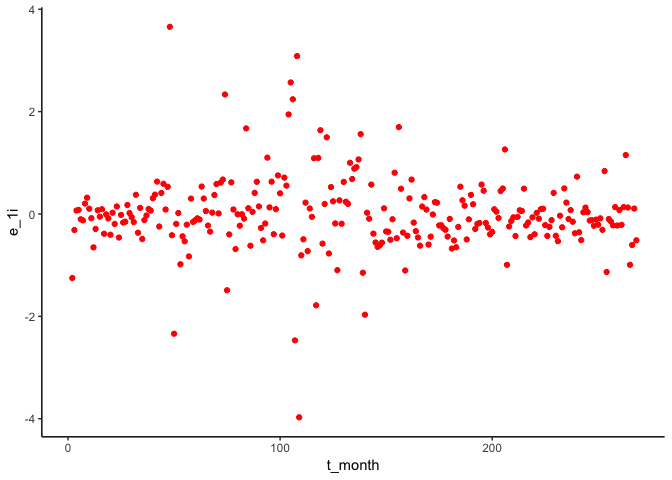
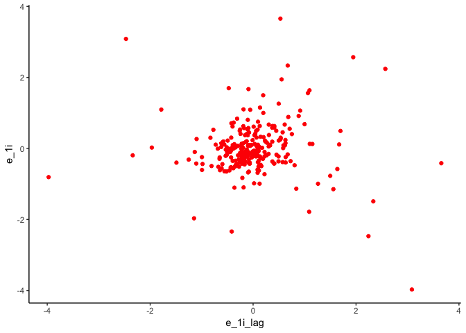
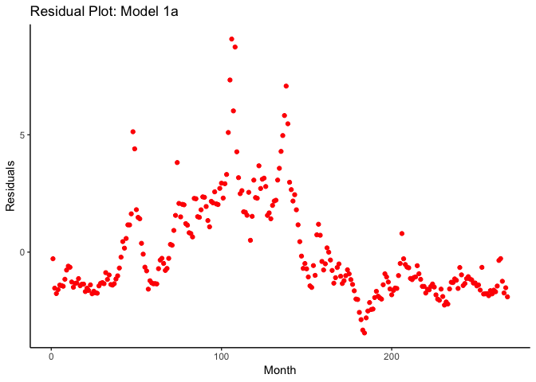
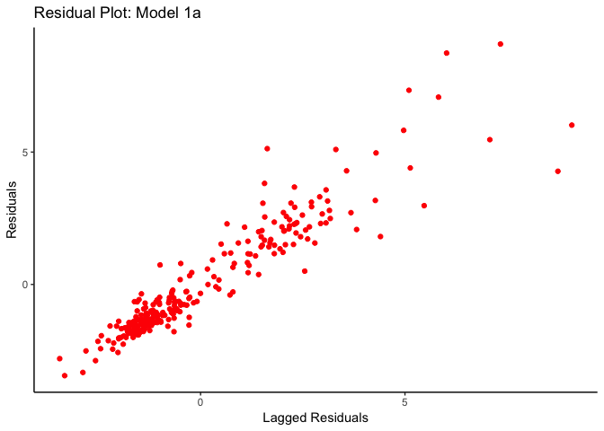
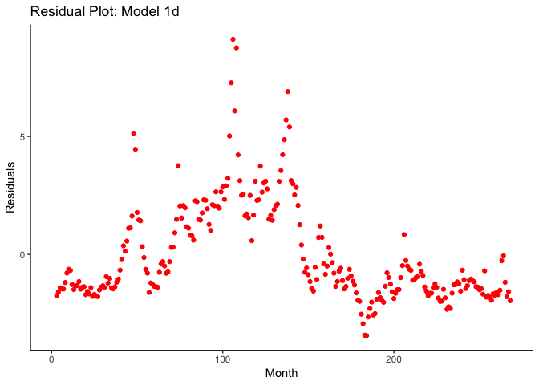
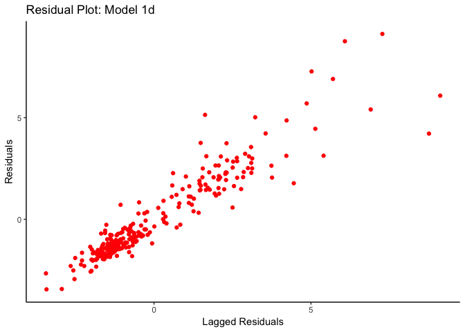

#Homework Notes: PS3

Hi guys, Welcome to week 8! This is the homework help section of the notes that will be more directly related to your homework assignment due next week.

Of course, we're going to start as we always do, loading some packages. However, we'll be using some new packages and some new parts of old packages. Let's load these

The main package we want to add to our usual set of suspects is the `lmtest` package which gives us access to  the `waldtest()` function - you guys saw this in class, but we'll walk through how to use it in regards to your homework.

## Lesson 0: Packages
If you need it, you can run the following command to get `pacman` on your computer, but you've likely done this already.

`install.packages("pacman",dependencies = T,repos = "http://cran.us.r-project.org")`

Now let's load our packages

```r
library(pacman)
#adding lmtest to our list.
p_load(tidyverse, magrittr, ggplot2, lmtest, broom)
```

## Lesson 0.5: Load the Data

We've done this bit before, but just to separate it out a bit, let's use `read_csv()`, from the `tidyverse` package to load the data, and then let's see what variables we have.


```r
gas_oil <- read_csv(your_file_path)
```

```
## Parsed with column specification:
## cols(
##   month_year = col_date(format = ""),
##   price_gas = col_double(),
##   price_oil = col_double(),
##   month = col_double(),
##   year = col_double(),
##   t_month = col_double(),
##   t = col_double()
## )
```

```r
names(gas_oil)
```

```
## [1] "month_year" "price_gas"  "price_oil"  "month"      "year"      
## [6] "t_month"    "t"
```

Great. Now let's move onto the first regression from the homework.

## Lesson 1: Running OLS; a static model

What is the difference between a 'dynamic' or a 'static' model?

A static model assumes that the impact of any given variable is only effecting the outcome today, whereas dynamic implies that the variable impacts the outcome in a future period. Also, past realizations of some variable may impact the current 'version' of it.

Let's take a look at this, by running a static model.

Let's try to estimate the following static model:

`P_t.Gas = B0 + B1*P_t.oil + u_t`

To do this in R is straightfoward, we already know how! 

We just need to run an OLS regression. We'll use `lm` to do so.


```r
static_mod = lm(price_gas~price_oil,data=gas_oil)
tidy(static_mod)
```

```
## # A tibble: 2 x 5
##   term        estimate std.error statistic  p.value
##   <chr>          <dbl>     <dbl>     <dbl>    <dbl>
## 1 (Intercept)   3.33     0.263       12.6  5.64e-29
## 2 price_oil     0.0173   0.00395      4.38 1.71e- 5
```

  What does this say? Well first off, it certainly seems like a higher price of oil today would indicate a higher price of gas today. That seems reasonable.

And our coefficient is quite significant. Anything else? We might be ignoring some dynamics here, so let's move on and try to estimate a dynamic version of this model like the one you do in your homework.
  
## Lesson 2: Dynamic version, estimating a dynamic model

Now suppose you believe the price of gas might depend on the price of oil today and yesterday. In other words, we are are interested in estimating the following model:
  
`P_t.Gas = B0+B1*P_t.oil+P_t-1.oil+B2*P_t-2.oil+u_t`

To do this, we need to use a 'lagged' version of P_t.oil, a variable which we do not currently have in our data-frame. A lag, really, is a fancy way of saying a version of a variable from before t. You have a few options to do this:
  
 -  Create a new variable $P_{t-1}^{oil}$ and add it to our dataframe, then do the regression
 -  Run the regression directly. 

Lets run with option one, and then two.

To do this, we need to use the `lag()` function. It takes two arguments, a vector, and a number of periods you want to "lag" your data. That is, if you want to look at the effect of price from two periods ago on price today, you'd use a `lag(price,2)` command to do so.

Remember, what will happen when your data is in it's first period? Trying to lag the data will produce an `NA` value because it's referencing some time period from before your dataframe's observations. Keep this in mind, because it can lead to errors. To explicitly show how the `lag` function works, I'm going to do something a little silly. Let's see.
  
**option 1**

```r
#When you are lagging a single period, the lag() fcn introduces a single NA to the beginning
#of your vector.
gas_oil$price_oil_t1 = c(NaN, na.omit(lag(gas_oil$price_oil,1)))

#When you are lagging two periods, the lag() fcn introduces TWO NAs to the beginning of your #vector.
gas_oil$price_oil_t2 = c(NaN,NaN,na.omit(lag(gas_oil$price_oil,2)))
```

Now that you have these lagged values, you can run your regression, by providing your new variables to the following equation:

`P_t.Gas = B0+B1*P_t.oil+B1*lag(P_t.oil)+B2*lag2(P_t.oil)+u_t`

Alternatively, you can pass these lag value functions directly to a regression object, which looks like this:

**option 2**


```r
price_2lag = lm(price_gas~price_oil+lag(price_oil, 1)+lag(price_oil, 2),data= gas_oil)
summary(price_2lag)
```

```
## 
## Call:
## lm(formula = price_gas ~ price_oil + lag(price_oil, 1) + lag(price_oil, 
##     2), data = gas_oil)
## 
## Residuals:
##     Min      1Q  Median      3Q     Max 
## -3.4435 -1.4610 -0.8231  1.4571  9.1188 
## 
## Coefficients:
##                    Estimate Std. Error t value Pr(>|t|)    
## (Intercept)        3.360828   0.268196  12.531   <2e-16 ***
## price_oil          0.023515   0.026608   0.884    0.378    
## lag(price_oil, 1)  0.003731   0.043601   0.086    0.932    
## lag(price_oil, 2) -0.010486   0.026581  -0.394    0.694    
## ---
## Signif. codes:  0 '***' 0.001 '**' 0.01 '*' 0.05 '.' 0.1 ' ' 1
## 
## Residual standard error: 2.127 on 262 degrees of freedom
##   (2 observations deleted due to missingness)
## Multiple R-squared:  0.06631,	Adjusted R-squared:  0.05562 
## F-statistic: 6.202 on 3 and 262 DF,  p-value: 0.0004379
```

What happened? Where did all of our significance go? Any ideas? We need to examine this further by seeing if these lags are actually providing some useful explanatory power. How do we normally do this?

Yup. F-tests
  
## Lesson 3: F-test
  
Lets run an F-test to compare our two models. To do this in R, we need something to test *ON*. In this case, it will be a `lm` object. Let's recreate our lm object from earlier.
  

```r
#recreate our 2-lag regression from earlier.
price_2lag = lm(price_gas~price_oil+lag(price_oil, 1)+lag(price_oil, 2),data= gas_oil)
```

Now we bring in the `lmtest` package for the `waldtest()` function. 

*note:* You can omit the `lmtest::` portion of the command below for your purposes, its only there just to explicitly state which package the `waldtest` command comes from, and isn't required to get the right answer.


```r
#lmtest package is needed here.
lmtest::waldtest(price_2lag,c("lag(price_oil, 1)","lag(price_oil, 2)"), test="F")
```

```
## Wald test
## 
## Model 1: price_gas ~ price_oil + lag(price_oil, 1) + lag(price_oil, 2)
## Model 2: price_gas ~ price_oil
##   Res.Df Df      F Pr(>F)
## 1    262                 
## 2    264 -2 0.1674 0.8459
```


Now, on your own, using one of the techniques describes above I want you to estimate the model:
  
`P_t.Gas = B0+B1*P_t.oil+P_t-1.oil+B2*P_t-1.Gas+u_t`

Okay. You can try now, and I'll provide the answer below.


```r
price1_gas1_mod <- lm(price_gas ~ lag(price_gas, 1) + price_oil + lag(price_oil, 1)
                      , data = gas_oil)
```


## Lesson 4/Question two: Autocorrelation

Okay, so Ed wants us to construct the plots with the residuals from the model in part 1i. 
First lets add residuals to the dataframe:
  
First, we can use the 'resid' command to extract residuals from an lm object and then store them in our `gas_oil` dataframe:


```r
gas_oil$e_1i<- c(NA, resid(price1_gas1_mod))
#We also want to graph these against *lagged* residuals, so, we can use the lag command to
#add lagged residuals as well
gas_oil$e_1i_lag <- c(NA, lag(resid(price1_gas1_mod)))
```

Now lets plot residuals against past residuals using ggplot2 to check visually for any error issues. We can do this using `ggplot` as you saw from last lab. 

### Plot residuals from model (1i)


```r
#plot residuals on time
plot_1 = ggplot(gas_oil)+
  geom_point(aes(x=t_month,y=e_1i), col = "red1") +
  theme_classic()
```


```r
#plot residuals on lagged residuals
plot_2 = ggplot(gas_oil)+
  geom_point(aes(x=e_1i_lag,y=e_1i), col = "red1") +
  theme_classic()
```


```r
#let's look at plot 1, residuals on time
plot_1
```

```
## Warning: Removed 1 rows containing missing values (geom_point).
```

<!-- -->

```r
#let's look at plot 2, residuals on lagged residuals
plot_2
```

```
## Warning: Removed 2 rows containing missing values (geom_point).
```

<!-- -->

Okay, now we need to repeat the plots from above for the model from part 1a and 1d. 
We can first create the residuals from our static equation and then examine them closely.
  


### residuals from model in 1a


```r
#create residuals for the static model
gas_oil$e_1a = residuals(static_mod)
#create lagged residuals for the static model
gas_oil$e_1a_lag = lag(gas_oil$e_1a, 1)
```


### residuals from model from 1 d

This one is a bit trickier. How many residuals do we actually have here? Do we have the same number of residuals as we do observations? Let's see.


```r
gas_oil$e_1d <- c(resid(price_2lag))
```

```
## Error in `$<-.data.frame`(`*tmp*`, e_1d, value = c(`3` = -1.75161433965873, : replacement has 266 rows, data has 268
```

```r
#have to use next bit for the plots
gas_oil$e_1d_lag <- c(lag(resid(price_2lag)))
```

```
## Error in `$<-.data.frame`(`*tmp*`, e_1d_lag, value = c(`3` = NA, `4` = -1.75161433965873, : replacement has 266 rows, data has 268
```

You'll notice that we're two short. **hah**. Sorry not sorry. 

But seriously, we lose two observations here, simply due to the lags in the model. We can't have coefficients for periods 1 and 2 because we don't have enough data to provide estimates for those periods. So, in order to do this, we need to code the following:


```r
gas_oil$e_1d <- c(NA, NA, resid(price_2lag))
#have to use next bit for the plots
gas_oil$e_1d_lag <- c(NA, NA, lag(resid(price_2lag)))
```

Now, we want to plot the residuals for this part of the question. Lets use ggplot again, to create the remaining graphs.
  
### plot for part 1a residuals


```r
plot_3 = ggplot(gas_oil)+
  geom_point(aes(x=t_month,y=e_1a), col = "red1") +
  labs(
    title =  "Residual Plot: Model 1a",
    x= "Month",
    y= "Residuals")+
  theme_classic()
```


```r
plot_4 = ggplot(gas_oil)+
  geom_point(aes(x=e_1a_lag,y=e_1a), col = "red1") +
  labs(
    title =  "Residual Plot: Model 1a",
    x= "Lagged Residuals",
    y= "Residuals")+
  theme_classic()
```

### plot for part 1d residuals


```r
plot_5 = ggplot(gas_oil)+
  geom_point(aes(x=t_month,y=e_1d), col = "red1") +
  labs(
    title =  "Residual Plot: Model 1d",
    x= "Month",
    y= "Residuals")+
  theme_classic()
```


```r
plot_6 = ggplot(gas_oil)+
  geom_point(aes(x=e_1d_lag ,y=e_1d), col = "red1") +
  labs(
    title =  "Residual Plot: Model 1d",
    x= "Lagged Residuals",
    y= "Residuals")+
  theme_classic()
```


```r
plot_3
```

<!-- -->

```r
plot_4
```

```
## Warning: Removed 1 rows containing missing values (geom_point).
```

<!-- -->

```r
plot_5
```

```
## Warning: Removed 2 rows containing missing values (geom_point).
```

<!-- -->

```r
plot_6
```

```
## Warning: Removed 3 rows containing missing values (geom_point).
```

<!-- -->


Model (1i) shows substantially less evidence of autocorrelation. Why do you think this is? 

Here is a hint: suppose P_t-1.gas belongs in the true model but you estimate model 1a or 1d instead (so you omit a variable that belongs in the model). What is the error term in the model you estimate a function of (another hint: P_t-1.gas is in the error term if you omit it. Why is **that** a problem?)


## Lesson 5: Testing for Autocorrelation

Lets test our model for second order autocorrelation, which means we get to use the Breusch-Godfrey test you learned about in class.To do this we will need to follow a few steps. However, let's logically ground this test first. Remember the Breusch Pagan test? For heteroskedasticity? What we're going to do follows similar logic.

However, what we're looking for is different, we don't care (here) about how much our X variables explain our error term, what we care about is if our **lagged** error terms do.

So, like in breusch pagan, let's find out how much our lagged error terms explain our present error terms, by running the following eqn:

`u_t = a_o+a1*P_(t).oil+a2*P_(t-1).gas+a3*P_(t-1)+r1*u_(t-1)+r2*u_(t-2)+e_t`

What terms would we want to test to determine second-order autocorrelation? The ones on our lagged error terms. Our test will then be:

H0: r_1= r_2 =0
What is the alternative hypothesis? `{r_1,r_2} != 0`. At least one of these guys doesn't equal zero 

Once we have this regression built we will take the residual model Rsq and compute the LM stat as we did before: LM = n*Rsq. We can then use this to get a p-value from a chisquared distribution. Lucky for you, Ed will allow us to use a command from the `lmtest` package: `waldtest`.Ok, lets get on with the test:
  
**1.) Let's create the lagged residuals**


```r
gas_oil$e_price_mod_lag1 <- c(NA, NA, lag(resid(price_2lag), 1))
gas_oil$e_price_mod_lag2 <- c(NA, NA, lag(resid(price_2lag), 2))
```

**2.) Now, we can run the regression outlined above**


```r
bg_mod <- lm(data = gas_oil, e_1d ~ price_oil_t1 + price_oil_t2 + e_price_mod_lag1 + e_price_mod_lag2)
```

**3.) Now, we can run the test.** 

This will be an *F-test* where we're dropping our autocorrelated error terms, so let's do that here:


```r
lmtest::waldtest(bg_mod, c("e_price_mod_lag1", "e_price_mod_lag2"), terms = 2)
```

```
## Wald test
## 
## Model 1: e_1d ~ price_oil_t1 + price_oil_t2 + e_price_mod_lag1 + e_price_mod_lag2
## Model 2: e_1d ~ price_oil_t1 + price_oil_t2
## Model 3: e_1d ~ price_oil_t1
##   Res.Df Df        F Pr(>F)    
## 1    259                       
## 2    261 -2 918.7715 <2e-16 ***
## 3    262 -1   0.0034 0.9532    
## ---
## Signif. codes:  0 '***' 0.001 '**' 0.01 '*' 0.05 '.' 0.1 ' ' 1
```

Awesome! Now what can we conclude from this test? 

I hope you guys have a great long weekend, and I will see you next week to hopefully talk a bit about instrumental variables. Good luck on the homework, and as always feel free to email me with corrections or questions if you have them.

